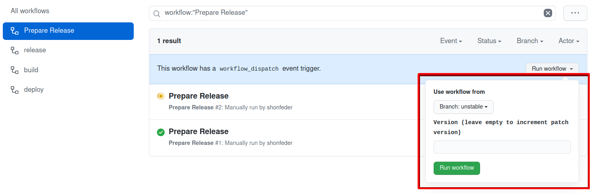

# Contributing

Thank you for your interest in contributing to Apalache!

Apalache is a symbolic model checker for [TLA+][].

<!-- TODO(shonfeder): Add code of conduct -->

The easiest
way to contribute is to [open a new issue][] to report a bug or a feature
request. If you want to contribute to the code base, [searching for "help
wanted"][help-wanted] is a good place to start. If you would like to begin
working on an existing issue, please indicate so by leaving a comment. If you'd
like to work on something else, open an issue to start the discussion.

The rest of this document outlines the best practices for contributing to
Apalache:

[TLA+]: https://lamport.azurewebsites.net/tla/tla.html
[help-wanted]: https://github.com/informalsystems/apalache/issues?q=is%3Aissue+is%3Aopen+label%3A%22help+wanted%22
[open a new issue]: https://github.com/informalsystems/apalache/issues/new/choose

<!-- markdown-toc start - Don't edit this section. Run M-x markdown-toc-refresh-toc -->
**Table of Contents**

- [Contributing](#contributing)
    - [Coordinating work](#coordinating-work)
    - [Decision Making](#decision-making)
    - [Making a pull request](#making-a-pull-request)
    - [Dependencies](#dependencies)
        - [Environment](#environment)
    - [Development Environment](#development-environment)
        - [Formatting](#formatting)
        - [Editors](#editors)
            - [IntelliJ IDEA](#intellij-idea)
            - [Emacs](#emacs)
                - [Install `metals-emacs`](#install-metals-emacs)
                    - [Arch](#arch)
                - [Doom Emacs](#doom-emacs)
                - [Vanilla Emacs](#vanilla-emacs)
    - [Testing](#testing)
        - [Unit tests](#unit-tests)
        - [Integration tests](#integration-tests)
            - [Installing Dependencies](#installing-dependencies)
            - [Running the tests](#running-the-tests)
        - [Python doctests](#python-doctests)
        - [Continuous Integration](#continuous-integration)
    - [Changelog](#changelog)
        - [Structure](#structure)
        - [Recording changes](#recording-changes)
    - [Releases](#releases)
        - [Via GitHub](#via-github)
        - [Manually](#manually)
            - [Requirements](#requirements)
            - [Prepare the release](#prepare-the-release)
            - [Cut the release](#cut-the-release)

<!-- markdown-toc end -->

## Coordinating work

Development on Apalache is distributed. As with any distributed system,
establishing effective synchronization and consensus on key properties requires
careful attention.

### Claiming a token for WIP

We synchronize and coordinate our work using GitHub issues. When an issue is
assigned to someone (or to several people), it serves as a token indicating that
substantive work on the item described on the issue is being done (or will be
done) by the assigned party. To avoid race conditions, we don't work on
substantive matters without first holding such a token. If you are eager to work
on something to which another party is assigned, please coordinate with them, e.g., by commenting on the related issue. It
is often possible to join the assigned party or transfer the assignment.

A corollary is that untracked work, work for which no issue exists or no
assignment has been claimed, cannot effectively be coordinated. To plan on, or
engage in, substantive work that is untracked raises the risk of race conditions
and disorganized effort.

### Volunteering to curate a subset of the code

Sometimes a contributor wants to be notified of any changes made to certain
files. We refer to contributors who have taken on this responsibility as
"curators" of the relevant code.

To volunteer as a curator of some part of the codebase, add your GitHub handle
to [.github/CODEOWNERS](.github/CODEOWNERS).

### Locking WIP pending review

Sometimes a contributor wants to ensure that they have a chance to review a
[pull request](#making-a-pull-request) before the changes are landed in
`main`. Contributors can lock the PR to prevent it from being merged before
they can complete a review by leaving an empty review on the PR, requesting
changes, along with a note like:

> I'd like to be sure I review this before it is merged.

## Decision Making

<!-- TODO(QUESTION): Do we want this much overhead to contributions? -->

When contributing to the project, the following process leads to the best chance
of landing changes:

1. All work on the code base should be motivated by a [Github Issue][]. The
   issue helps capture the problem we're trying to solve and allows for early
   feedback.
2. Once the issue is created, maintainers may request more detailed
   documentation in the form of a [Request for Comment (RFC)][rfc] or
   [Architectural Decision Record (ADR)][adr].
   - Please draft ADRs by starting with [our
     template](./docs/src/adr/NNNadr-template.md).
3. Discussion at the RFC stage will build collective understanding of the
   dimensions of the problem and help structure conversations around trade-offs.
4. When the problem is well understood but the solution leads to large
   structural changes to the code base, these changes should be proposed in the
   form of an ADR. The ADR will help build consensus on an overall strategy to
   ensure the code base maintains coherence in the larger context. If you are
   not comfortable with writing an ADR, you can open a less-formal issue and the
   maintainers will help you turn it into an ADR.
5. When the problem and proposed solution are well understood, implementation
   can begin by opening a [pull request](#making-a-pull-request).

## Making a pull request

We develop on the `main` branch and practice [trunk-based
development](https://trunkbaseddevelopment.com/).

Nontrivial changes should start with a [draft pull request][] against
`main`. The draft signals that work is underway. When the work is ready for
feedback, hitting "Ready for Review" will signal to the maintainers that you are
ready for them to take a look.

Where possible, implementation trajectories should aim to proceed as a series of
small, logically distinct, incremental changes, in the form of small PRs that
can be merged quickly. This helps manage the load for reviewers and reduces the
likelihood of merge conflicts or strategically misdirected work.

Each stage of the process is aimed at creating feedback cycles which align
contributors and maintainers to make sure:

- Contributors don’t waste their time implementing/proposing features which
  won’t land in `main`.
- Maintainers have the necessary context in order to support and review
  contributions.

## Dependencies

For setting up the local build, see the [instructions on building from
source](https://apalache-mc.org/docs/apalache/installation/source.html).

### Environment

The necessary shell environment is specified in [.envrc](./.envrc). You can:

- use [direnv][] to load the environment automatically
- source this file manually from your shell
- or use it as a reference for what to put in your preferred rc files

[direnv]: https://direnv.net/

#### Compiler warnings

We fail CI builds on compiler warnings.

To have compiler warnings also fail on local builds, set

```sh
export APALACHE_FATAL_WARNINGS=true
```

You may add this to your `.local-envrc` file at the root of this repo to have
`direnv` load this into your development environment.

## Development Environment

If you use a different development environment or editor set up, please document
it here!

### Nix for development dependencies

We provide a nix shell in case you want to use nix to manage your development
environment and dependencies. The primary benefits of using the nix shell is
that it allows us to keep environments consistent, and distribute updates to
environment dependencies. Alternatively, you can also use `direnv` to load
dependencies from nix.

#### Getting Nix

There is already nix setup documentation in [Informal Systems' cosmos.nix
repo](https://github.com/informalsystems/cosmos.nix#setup). For the time being,
ignore any direction about the cosmos cache.

<!-- TODO: ADD INFO ABOUT APALACHE CACHE ONCE IMPLEMENTED -->

#### Running the nix shell

Once you have `nix` installed, build and enter the clean development shell with:

```sh
$ nix develop
```

#### Loading nix dependencies with direnv

If you want to use direnv to setup your environment with nix (instead of using a
shell), you will need to add `use flake;` to your `.local-envrc`, and then
running `direnv allow`:

```sh
echo "use flake;" >> .local-envrc && direnv allow
```

You can also add a `direnv` extension/package to your IDE of choice to have
those dependencies set up for the IDE to use.

#### Updating nix dependencies

To update one of the flake inputs you can run: `nix flake lock --update-input <input-name>`

To update all of the inputes you can run: `nix flake update`, it is recommended
to update dependencies one by one though.

### Formatting

We use [scalafmt](https://scalameta.org/scalafmt/) to standardize formatting
across the codebase. It is integrated into our sbt build configuration, and
formatting fixes will be applied on build, or via the make target `make fmt-fix`.

In addition, we have configured the compiler to warn on unused imports and
variables, and we have enabled [scalafix](https://scalacenter.github.io/scalafix/)
to automate removal of unused values. This is also run by `fmt-fix` target.

However, for a smoother development experience you should ensure your editor
automatically runs formatting. The scalafmt site documents installation for all
common editors.

Our scalafmt configuration is specified in [./.scalafmt.conf](./.scalafmt.conf).

### Editors

#### IntelliJ IDEA

Download the community edition of [IntelliJ
IDEA](https://www.jetbrains.com/idea/) and set up a new project. If you already
have IntelliJ installed, please ensure you using version 2021.3.1 or later.
We've had reports of build failures with earlier versions.

For some tests to succeed, you will have to [set the environment
variable](https://www.jetbrains.com/help/objc/add-environment-variables-and-program-arguments.html#add-environment-variables)
`APALACHE_HOME` to the root of the Apalache source tree.

#### Emacs

You can use the [metals][] Scala language server together with [lsp-mode][] for
a nice IDE experience in the world's best lisp driven operating system.

If you are developing in Emacs, you probably also want to get familiar with the
incremental build server [bloop](./docs/internal/using-bloop.md).

##### Install `metals-emacs`

###### Arch

Using yay to install from AUR:

```sh
yay -Syu metals
```

##### Doom Emacs

[Doom Emacs][doom-emacs] streamlines configuration and installation:

Edit your [~/.doom.d/init.el](~/.doom.d/init.el), to uncomment `scala` and
configure it use lsp:

```elisp
       (scala              ; java, but good
        +lsp)
```

Run `doom sync` and restart. That's it.

If you hit any snags, you might also consult [this
writeup][writeup]

[doom-emacs]: https://github.com/hlissner/doom-emacs
[metals]: https://scalameta.org/metals/
[lsp-mode]: https://github.com/emacs-lsp/lsp-mode
[writeup]: https://siawyoung.com/blog/code/2020-02-06-installing-metals-emacs-doom

##### Vanilla Emacs

For installation and configuration in vanilla emacs, see
https://scalameta.org/metals/docs/editors/emacs.html

## Documentation

We maintain three principle kinds of documentation:

- Tutorials and manuals meant as general user documentation can be found in [./docs/src](./docs/src).
- ADRs and RFCs documenting design and technical decisions are meant for developers
  and expert users and can be found in [./docs/src/adr](./docs/src/adr)
- API documentation meant for developers, which is written using
  [Scaladoc](https://docs.scala-lang.org/style/scaladoc.html) and lives
  alongside the source code.

You can build and view the API docs locally by running the make target

```sh
make docs-view
```

This will build current API docs, open the file in your browser, and watch the
files for changes, rebuilding the docs on changes.

## Testing

### Build and run Apalache from source

Execute apalache from the unpackaged source, ensuring any updates are built, run

```sh
make run <arguments>
```

### Unit tests

Run the units

```sh
make test
```

### Logging in unit tests

We disable unit test log output for subprojects where necessary, to avoid output
flooding the console. This affects unit tests only, and is configured in a
per-subproject logback configuration file `test/resources/logback-test.xml`.
This file also contains a commented-out console appender that can be enabled if
needed for debugging purposes.

### Integration tests

#### Installing Dependencies

We use [mdx](https://github.com/realworldocaml/mdx) for CLI integration tests.

Here is a platform agnostic installation recipe:

```sh
# Install opam
sh <(curl -sL https://raw.githubusercontent.com/ocaml/opam/master/shell/install.sh)
# Install mdx
opam install mdx
```

For alternative installation methods for opam, see https://opam.ocaml.org/doc/Install.html

#### Running the tests

To build a fresh executable and run all the integration tests, execute

```sh
make integration
```

For more details on running the integration tests, see [./test/tla/cli-integration-tests.md](./test/tla/cli-integration-tests.md).

### Python doctests

To check the python snippets in the language manual, execute

```sh
python3 -m doctest -v docs/src/lang/*.md
```

### Continuous Integration

We run continuous integration tests using [GitHub actions](https://github.com/informalsystems/apalache/actions).

The CI configuration is located in
[.github/workflows/main.yml](.github/workflows/main.yml).

## Changelog

### Structure

[./.unreleased/](./.unreleased/)
: A living record of the changes not yet released. It contains a subdirectory
  for each supported category of change.

[./RELEASE.md](./RELEASE.md)
: A frozen record documenting the changes added since the last release. This is
  only present in release commits.

[./CHANGES.md](./CHANGES.md)
: The changelog accumulating the history of all the changes, across all
  versions.

### Recording changes

Every PR introducing changes that are likely to impact the observable behavior
of Apalache MUST add at least one entry into the appropriate subdirectory of
[.unreleased/](./.unreleased/).

#### What kinds of changes to record

We break entries into the follow categories:

[breaking-changes](https://en.wiktionary.org/wiki/breaking_change)
: A breaking change occurs when behavior is introduced that could cause existing
  usage patterns to fail. Examples include adding/removing CLI flags or changing
  the representation of data that is emitted as part of our public API.

[features](https://en.wikipedia.org/wiki/Software_feature)
: Features include adding any user-visible functionality or making significant
  improvements to existing functionality.

[bug-fixes](https://en.wikipedia.org/wiki/Software_bug)
: "A software bug is an error, flaw or fault in computer software that causes it
  to produce an incorrect or unexpected result." We only record the removal of
  bugs and not their introduction ;)

[documentation](https://en.wikipedia.org/wiki/Documentation)
: Documentation includes the inline CLI documentation and the user manual.

We generally do not make entries for changes that don't affect the observable
behavior of the program for users. E.g., we don't add entries for things like
design documentation, improvements to the development environment, or code
reorganization that doesn't impact the public API.

#### How to record a change

An single entry is made by creating a single markdown file in the appropriate
directory. To enter `n` distinct changes, create `n` different markdown files.

As an example, if your PR introduces the new feature `Foo`, you would add a file
`.unreleased/features/foo.md` with content along the lines of

```markdown
Added feature Foo, see #123
```

where `#123` is the ID of the issue or pull request that best explains the
motive and nature of the change.

The file name is generally irrelevant, but if the order of changelog entries
matters, you can use the lexicographical ordering of file names in a directory
to enforce it

The contents of each file will be converted into a single bullet point item in
the release notes under a heading corresponding to the sub-directory. E.g., the
above example will be included in the changelog for the next release as:

```markdown

### Features

- Added feature Foo, see #123
```

## Releases

### Via GitHub

We have configured our GitHub CI to automate the release process. The workflows
are configured in [./.github/workflows/prepare-release.yml][] and
[./.github/workflows/release.yml][].

The process proceeds in two steps:

1. CI prepares a release, and opens a PR with the version changes and release
   notes. These are [manually via the GitHub UI][github-ui].
   - The scheduled releases increment the patch number.
   - Use the _Version_ input field to manually specify the version to release.

   
2. A human reviews the PR, approves it, and **merges** (_DO NOT SQUASH OR
   REBASE_) into the trunk, at which point CI kicks in to:
   - tag the commit
   - package the artifact
   - publish it as a GitHub release
   - announce the release in our internal `#releases` slack channel

[./.github/workflows/prepare-release.yml]: ./.github/workflows/prepare-release.yml
[./.github/workflows/release.yml]: ./.github/workflows/prepare-release.yml
[github-ui]: https://github.com/informalsystems/apalache/actions?query=workflow%3A%22Prepare+Release%22

### Manually

#### Requirements

- [hub](https://github.com/github/hub) installed
  - With a `GITHUB_TOKEN` variable in your shell environment holding an access
    token with repo permissions.

#### Prepare the release

Assuming the current version recorded in the project's `VERSION` file is
`l.m.n-SNAPSHOT`, the manual release process is as follows:

- [ ] `git checkout main && git pull`
- [ ] Run `./script/release-prepare.sh` to
  - create and checkout a branch `release/l.m.n`.
  - prepare and add a release commit `[release] l.m.n`
  - update the changelog
  - bump the version number
  - commit the changes
  - opens a pr into `main` with the title `[release] l.m.n`.
- [ ] Get the PR reviewed and merged and **DO NOT SQUASH THE CHANGES** on merge.

If you need to set a specific version (e.g., to increment to a major version),
override the `RELEASE_VERSION` when preparing the release:

```sh
RELEASE_VERSION=l.m.n ./script/release-prepare.sh
```

#### Cut the release

When the PR is merged into `main`:

- [ ] Checkout the `[release] l.m.n` commit from the latest `main`
- [ ] Run `./script/release-publish.sh` to
  - tag the release commit
  - package the
  - create the release on github
- [ ] Update the download links at https://github.com/informalsystems/apalache/blob/gh-pages/_config.yml#L7

[Github Issue]: https://github.com/informalsystems/apalache/issues
[rfc]: https://en.wikipedia.org/wiki/Request_for_Comments
[adr]: https://en.wikipedia.org/wiki/Architectural_decision
[draft pull request]: https://github.blog/2019-02-14-introducing-draft-pull-requests/
