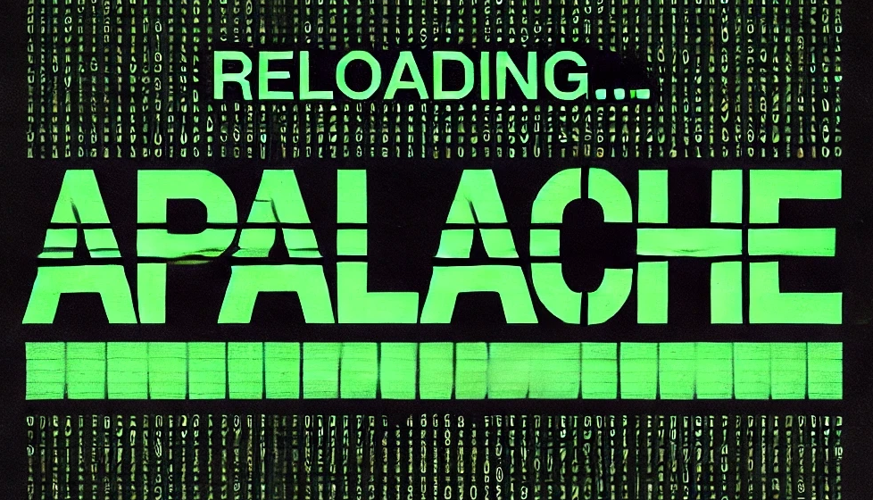

<h1><a href="https://apalache-mc.org/">APALACHE</a></h1>

A symbolic model checker for TLA+

[![main badge][]][main-ci]

[main badge]: https://github.com/apalache-mc/apalache/workflows/build/badge.svg?branch=main

[main-ci]: https://github.com/apalache-mc/apalache/actions?query=branch%3Amain+workflow%3Abuild

Apalache translates [TLA+][] into the logic supported by SMT solvers such as
[Microsoft Z3][]. Apalache can check inductive invariants (for fixed or bounded
parameters) and check safety of bounded executions (bounded model checking). To
see the list of supported TLA+ constructs, check the [supported features][]. In
general, Apalache runs under the same assumptions as [TLC][]. However, Apalache
benefits from constraint solving and can handle potentially larger state-spaces,
e.g., involving integer clocks and Byzantine faults.

To learn more about TLA+, visit [Leslie Lamport's page on TLA+][] and his [Video
course][].

## Releases

Check the [releases page][] for our latest release.

For a stable release, we recommend that you pull the latest docker image with
`docker pull ghcr.io/apalache-mc/apalache:main`, use the jar from the
most recent release, or checkout the source code from the most recent release
tag.

To try the latest cool features, check out the head of the [main branch][].

You can also find Apalache packaged via Nix at [cosmos.nix](https://github.com/informalsystems/cosmos.nix)

For more information on installation options, see [the
manual][user-manual-installation].

## Success stories

Check [Apalache examples][] that demonstrate how to use the strengths of Apalache.
Also, check the [standard repository of TLA+ examples][].

## Getting started

- Read the [Beginner's tutorial][].
- Read the [Apalache user manual][user-manual].
- Consult the (WIP) [Idioms for writing better TLA+][idioms].
- Consult the (WIP) [TLA+ language manual for engineers][language-manual].

## Community

- Join the chat in the [Apalache zulip stream].
- [Contribute](./CONTRIBUTING.md) to the development of Apalache.

## Funding and Sponsorship

Currently, Apalache is not funded by any organization. As a result,
it is de-facto funded by its current maintainers and contributors,
including [Igor Konnov][], [Jure Kukovec][], and [Thomas Pani][].
If you would like to sponsor the project, please contact us, or
simply sponsor us on GitHub by clicking the "Sponsor" button!

We are grateful for the past financial support in the form of grants or
employment from the following organizations:

 - [Informal Systems][] (Canada/Switzerland/Austria): 2020-2024
 - [Vienna Business Agency][] (Austria): 2021-2023
 - [Interchain Foundation][] (Switzerland): 2019-2023
 - [WWTF][] (Austria): Vienna Science and Technology Fund 2016-2020
 - [Inria Nancy][] and [LORIA][] (France): 2018-2019
 - [TU Wien][] (Austria): 2016-2020

More details on the [Funding page](./FUNDING.md).

## Website

Our current website is served at https://apalache-mc.org .

The site is hosted by github, and changes can be made through PRs into the
[gh-pages](https://github.com/apalache-mc/apalache/tree/gh-pages) branch of this repository. See the README.md on that
branch for more information.

The user documentation is automatically deployed to the website branch as per
the [CI configuration](./.github/workflows/deploy.yml).

<!-- TODO:this section should go to the website

## Talks

- [Informal Systems Tutorial: TLA+ Basics](https://www.youtube.com/watch?v=peKYddIvCIs)

- [Extended version of the Apalache tutorial](https://www.youtube.com/watch?v=Ml7d_3vlH88).
  TLA+ tutorial at DISC 2021 (October 2021).

- [How TLA+ and Apalache Helped Us to Design the Tendermint Light Client](https://www.crowdcast.io/e/interchain-conversations-II/38).
  Interchain Conversations 2020 (December 2020).

- [Model-based testing with TLA+ and Apalache](https://youtu.be/aveoIMphzW8).
  TLA+ Community Event 2020 (October 2020).

- [Type inference for TLA+ in Apalache](https://youtu.be/hnp25hmCMN8).
  TLA+ Community Event 2020 (October 2020).

- [Formal Spec and Model Checking of the Tendermint Blockchain Synchronization Protocol](https://youtu.be/h2Ovc1KWlXM)
  2nd Workshop on Formal Methods for Blockchains (July 2020).

- [Showing safety of Tendermint Consensus with TLA+ and Apalache](https://www.youtube.com/watch?v=aF20-28sMII).
  Dev session at Informal Systems (May 2020).

- [TLA+ model checking made symbolic](https://www.youtube.com/watch?v=e66FGgRzaqw)
  OOPSLA 2019 (October 2019).

- [Bounded model checking of TLA+ specifications with SMT](https://www.youtube.com/watch?v=Xl1--arESl8)
  TLA+ Community Event 2018 (July 2018).
-->

<!-- TODO: This section should also go to the website
## Academic papers

To read an academic paper about the theory behind Apalache,
check our [paper at OOPSLA19](https://dl.acm.org/doi/10.1145/3360549).
For the details of our novel encoding using SMT arrays, check our
[paper at TACAS23](https://link.springer.com/chapter/10.1007/978-3-031-30823-9_7).
Related reports and publications can be found at the
[Apalache page at TU Wien](http://forsyte.at/research/apalache/).
-->

---

[tla+]: http://lamport.azurewebsites.net/tla/tla.html
[microsoft z3]: https://github.com/Z3Prover/z3
[supported features]: https://apalache-mc.org/docs/apalache/features.html
[tlc]: http://lamport.azurewebsites.net/tla/tools.html
[leslie lamport's page on tla+]: http://lamport.azurewebsites.net/tla/tla.html
[video course]: http://lamport.azurewebsites.net/video/videos.html
[releases page]: https://github.com/apalache-mc/apalache/releases
[master]: https://github.com/apalache-mc/apalache/tree/master
[main branch]: https://github.com/apalache-mc/apalache/tree/main
[apalache zulip stream]: https://informal-systems.zulipchat.com/#narrow/stream/265309-apalache
[tendermint specs]: https://github.com/tendermint/tendermint/tree/master/spec/light-client/accountability
[tendermint blockchain]: https://github.com/tendermint
[standard repository of tla+ examples]: https://github.com/tlaplus/Examples
[apalache benchmarks]: https://github.com/apalache-mc/apalache-tests
[checking inductive invariants]: https://github.com/apalache-mc/apalache-tests/blob/master/results/001indinv-report.md
[bounded model checking]: https://github.com/apalache-mc/apalache-tests/blob/master/results/002bmc-report.md
[user-manual]: http://apalache-mc.org/docs/index.html
[user-manual-docker]: https://apalache-mc.org/docs/apalache/installation/docker.html
[user-manual-installation]: https://apalache-mc.org/docs/apalache/installation/index.html
[language-manual]: https://apalache-mc.org/docs/lang/index.html
[idioms]: https://apalache-mc.org/docs/idiomatic/index.html
[light client specs]: https://github.com/tendermint/tendermint/tree/master/spec/light-client/verification
[model-based testing]: https://github.com/informalsystems/tendermint-rs/tree/master/light-client/tests/support/model_based#light-client-model-based-testing-guide
[apalache-mc.org]: https://apalache-mc.org
[TLA-Apalache workshop]: https://github.com/informalsystems/tla-apalache-workshop
[Beginner's tutorial]: https://apalache-mc.org/docs/tutorials/entry-tutorial.html
[Apalache examples]: https://github.com/konnov/apalache-examples
[WWTF]: https://wwtf.at/index.php?lang=EN
[TU Wien]: https://www.tuwien.at/
[Inria Nancy]: https://www.inria.fr/en/inria-centre-universite-lorraine
[LORIA]: https://loria.fr
[Interchain Foundation]: https://interchain.io/
[Informal Systems]: https://informal.systems/
[Vienna Business Agency]: https://viennabusinessagency.at/
[Igor Konnov]: https://github.com/konnov
[Jure Kukovec]: https://github.com/kukovec
[Thomas Pani]: https://github.com/thpani