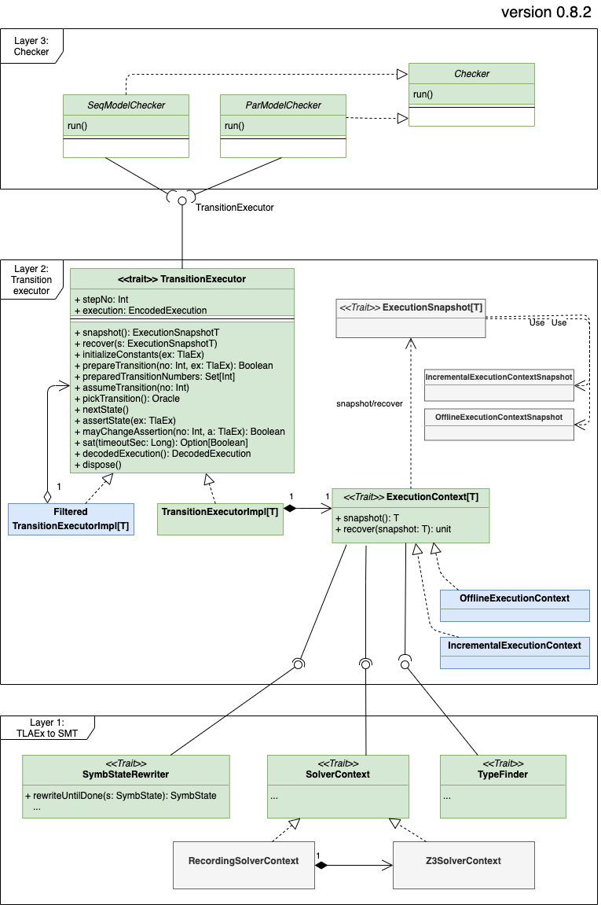

# ADR-003: transition executor (TRex)

Transition executor is a new abstraction layer between the model checker and
the translator of TLA+ expressions to SMT. The goal of this layer is to do the
following:

 - encapsulate the interaction with:
   - the translator to SMT (called `SymbStateRewriter`)
   - the SMT solver (accessed via `Z3SolverContext`)
   - the type checker (accessed via `TypeFinder`)
 - provide the model checker with an API for symbolic execution:
   - independent of the assumptions about how satisfiability of TLA+
     formulas is checked
   - constraints can be added and removed incrementally,
     even if the background SMT solver is non-incremental
     (this is important as some constraints are better solved by incremental
      solvers and some constraints are better solved by offline solvers)
   - the state of the symbolic execution (context) can be saved
     and restored on another machine (essential for a multicore or distributed
     model checker)


TRex can be thought of as an API for a satisfiability solver on top of TLA+ (in
the fragment of [KerA+]). We can even say that TRex is a solver for TLA+, in
contrast to an SMT solver, which is a solver for theories in first-order logic.
As TLA+ is built around the concepts of a state and a transition, the TRex API
abstracts symbolic execution in terms of symbolic states and symbolic
transitions.

## Classes

The figure below shows the class diagram of the essential classes
in TRex.  `TransitionExecutor` provides the higher level (a model checker) with
an API for symbolic execution. `TransitionExecutorImpl` is the implementation
of `TransitionExecutor`. It maintains `ExecutionContext` that interacts with
the lower layer: the translator to SMT, the SMT solver, and the type checker.

Importantly, there are two implementations of `ExecutionContext`: an
incremental one (`IncrementalExecutionContext`) and an offline one
(`OfflineExecutionContext`). In contrast to the standard stack API of SMT
solvers (push/pop), `ExecutionContext` operates in terms of differential
snapshots. The implementation decides on how to translate differential
snapshots into interactions with the SMT solver.

`IncrementalExecutionContext` simply maintains the SMT context stack by calling
`push` and `pop`. When a snapshot must be taken, it simply returns the depth of
the context stack.  Recovery from a snapshot is done by a sequence of calls to
pop. (`IncrementalExecutionContext` is not able to recover to an arbitrary
snapshot that is not subsumed by its current stack.) Thus,
`IncrementalExecutionContext` can be used for efficient interaction with an
incremental SMT solver on a single machine (even in a single thread, as Z3
contexts are not multithreaded).

`OfflineExecutionContext` records calls to SMT with the wrapper
`RecordingZ3SolverContext`. A snapshot produces an hierarchical log of calls to
SMT that can be replayed in another `OfflineExecutionContext`, even on another
machine.



## Interaction with TransitionExecutor

We demonstrate a typical interaction with `TransitionExecutor` for the
following TLA+ specification, which has been preprocessed by the passes
preceding the model checker pass:

```tla
EXTENDS Integers
CONSTANT N
VARIABLES x

Init$0 ==
  x = 0

Next$0 ==
  x' = x + N

Next$1 ==
  x' = x - N

Inv ==
  x >= 0
```

[KerA+]: https://apalache.informal.systems/docs/apalache/kera.html

