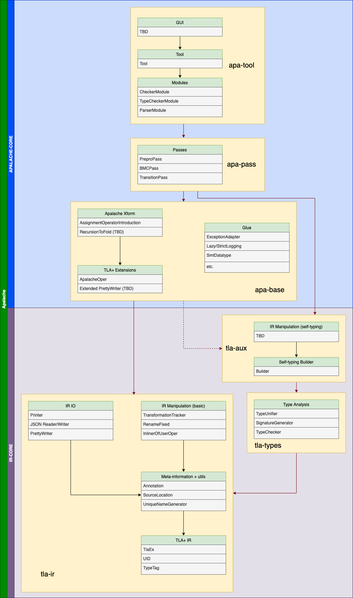

# ADR-007: Apalache Package Structure Guidelines

| author       | revision |
| ------------ | --------:|
| Jure Kukovec |        1 |

This ADR documents the design policies guiding the package and dependency structure of Apalache.
When introducing new classes, use the guidelines defined below to determine which package to place them in.

## 1. Level Structure

We define Apalache architecture in terms of enumerated levels (L0, L1, L2, etc.). Each level may only hold dependencies belonging to a lower level.

Levels are split into two strata:

  1. Interface core: Classes within the interface core relate to general TLA+ concepts, and are intended to be usable by 3rd party developers.
  2. Apalalache core: Classes in the Apalache core relate to specific Apalache- or model-checking- functionality
  
Staking the "core" strata together gives us the complete stack implementing Apalache. 

## 2. Interface core

Together, L0-L6 make up the interface core. Notably, these levels are Apalache-agnostic. The concepts of these levels are packaged as follows:

 1. `tla-ir`    : L0-L3
 2. `tla-types` : L4
 3. `tla-aux`   : L5-L6

# L0: TLA+ IR

In L0, we have implementations of the following concepts:

 - The internal representation of TLA+, with the exception of:
    - Apalache-specific operators (`ApalacheOper`)
 - Any utility required to define the IR, such as:
    - `UID`s
    - `TypeTag`s & TT1

# L1: Auxiliary structures

In L1, we have implementations of the following concepts:

 - Meta-information about the IR, such as:
    - Annotations
    - Source information
 - Generic utilities, such as:
    - Unique name generators

# L2: IR IO

In L2, we have implementations of the following concepts:

 - String printers for TLA-IR
 - Reading from or writing to files (`.tla`, `.json`, TLC-formats) 

# L3: Basic IR manipulation

In L3, we have implementations of the following concepts:

 - TLA+ transformations that:
    - do not introduce operators excluded from L0
    - have type-correctness asserted by manual inspection

Any implementation of a L3 transformation must be explicitly annotated and 
special care should be made during PR review to ascertain type-correctness. Whenever possible, unit tests should test for type correctness.

# L4: Type analysis

In L4, we have implementations of the following concepts:

 - Any calculus in a TLA+ type system, including:
    - Unification
    - Sub/supertype relations 
 - Any type-related static analysis, such as:
    - Type checking
    - Type inference

# L5: Self-typing Builder:

In L5, we have implementations of the following concepts:

 - The TLA-IR builder

# L6: Type-guaranteed IR manipulation

In L6, we have implementations of the following concepts:

 - TLA+ transformations that:
    - do not introduce operators excluded from L0
    - do not manually introduce IR constructors and type-tags, but use the self-typing builder instead

## 3. Apalache core

L7+ make up the Apalache core. The concepts of these levels are packaged as follows:

 1. `apa-base` : L7-L9
 2. `apa-pass` : L10
 3. `apa-tool` : L11+

If individual passes in L10 are deemed complex enough, they may be placed in their own package (e.g. `apa-bmc`)

# L7: Extensions of TLA+

In L7, we have implementations of the following concepts:

 - Any Apalache-specific operators, introduced into the IR (e.g. `ApalacheOper`)
 - Extensions of any printer/reader/writer classes with support for the above specific operators

# L8: Apalache-specific transformations

In L8, we have implementations of the following concepts:

 - TLA+ transformations that introduce operators from L7

Like L3 transformations, if the builder is not used, the transformation should be explicitly marked and inspected for type-correctness.

# L9: Glue

In L9, we have implementations of the following concepts:

 - Classes and traits used to define Apalache workflow or auxiliary functions, but not core functionality, such as:
    - Exception handling
    - Logging
 - Classes and traits related to 3rd party technologies, such as:
    - SMT
    - TLC config

# L10: Pass implementations

In L10, we have implementations of the following concepts:

 - Apalache passes and related infrastructure

# L11: Module implementations

In L11, we have implementations of the following concepts:

- Apalache modules

# L12: Tool wrapper:

In L12, we have implementations of the following concepts:

 - Apalache CMD interface

# L13: GUI

In L13, we have implementations of the following concepts:

 - Graphical interface, if/when one exists

## 4. Aliases, factories and exceptions

Any alias or factory belongs to the lowest possible level required to define it. For example, `type uidToExMap = Map[UID, TlaEx]` belongs to L0, since `UID` and `TlaEx` are both L0 concepts, so it should be defined in an L0 alias package, even if it is only being used in a package of a higher level. 

Any exception belongs to the lowest possible level, at which it can be thrown. For example, `AssignmentException` belongs to L10, as it is thrown in the `TransitionPass`.

## 5. Visualization

A visualization of the architecture and the dependencies can be found below. Black arrows denote dependencies between components within a package, while red arrows denote dependencies on packages. Dotted arrows denote conditional dependencies, subject to the concrete implementation of components that have not yet been implemented (marked TBD).
Classes within the level boxes are examples, but are not exhaustive.

