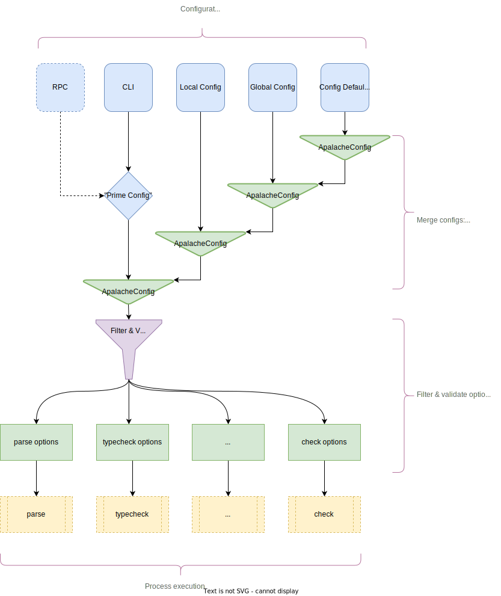

# ADR-022: Unify Configuration Management and "Pass Options"

| authors                                | last revised    |
| -------------------------------------- | --------------: |
| Shon Feder                             | 2022-08-15      |

**Table of Contents**

- [Summary (Overview)](#summary)
- [Context (Problem)](#context)
- [Options (Alternatives)](#options)
- [Solution (Decision)](#solution)
- [Consequences (Retrospection)](#consequences)

## Summary

In the context of extending Apalache's functionality and adding new features\
facing the need to reason about our program configuration and make execution thread safe\
we decided for unifying our CLI input with our configuration management system\
to achieve a more modular architecture and greater static guarantees\
accepting the development costs and possible increased cost of introducing new CLI inputs in the future.

## Context

As work has proceeded on [Shai][], following the design laid out in [RFC 010][], it
has been revealed that we can provide value to the MBT team  by exposing the
current command line interface via RPC calls (see [#2013][]). This functionality
will require a way of receiving program configuration input from a gRPC call and
forwarding that configuration on to various pass executors.

Additionally, for a long while we have been aware of the limitations and
brittleness of our current system for storing and communicating configured
options throughout the paths of the program (see [#1174][]) and we have
recognized the value we might derive by unifying our CLI inputs with our
configuration management system (see [#1177][]).

## Options

We considered trying to implement the needed RPCs without addressing [#1174] and
[#1177], but two factors convinced us that these were legitimate pre-requisites:

1. If we try to expose the current CLI functionality via RPC calls without first
   introducing a unifying abstraction, any flag or option introduced on one side
   (e.g., for the CLI) will require duplicated work the other side (e.g., for
   the RPC). The high maintenance cost is liable to cause the two endpoints to drift.
2. The current method of communicating configured values to the rest of the
   program is through an untyped, mutable, singleton map. This means the
   configurations are not thread-safe, since mutation of the option map in a
   concurrent RPC could change the configurations of another RPC call in
   process.

Thus, we resolved to proceed with unifying the CLI with configuration system
described in [ADR 013][], and replacing the mutable, untyped option map
with an immutable, statically typed data structure representing the possible
configurable of our various routines.

## Solution

Following [ADR 013][], we introduced support for a limited set of configurable
values that could be read from either a config file or the CLI, and recorded in
an instance of the small `ApalacheConfig` class. However, the most CLI inputs
were fed directly into the options map, without interacting at all with the
configuration system.

To address factor (1) above, we have decided to make the communication of all
configurable inputs pass through an `ApalacheConfig`. As a special case, the CLI
is reworked to produce an instance of `ApalacheConfig`, which is then merged
with configurations from other sources, before being passed along to the various
process executors. Requiring that all program configuration be mapped through
the `ApalacheConfig` will enable us to automatically derive configurations from
incoming RPC data, and since any relevant updates to the CLI inputs will have to
be reflected in changes to the `ApalacheConfig`, we can be assured that the two
input methods will stay in sync.

To address (2), it would be enough replace the `PassOptions` map with the
`ApalacheConfig`, which could then be supplied directly to the process
executors. But two further considerations have lead us to adopt an additional
level of abstraction:

1. In order to support merging of partial configurations (with fallback to
   defaults), the values of the `ApalacheConfig` must all be `Optional`. However,
   before we begin executing a process, we know what data the process will
   **require**. If we just pass the `ApalacheConfig` directly, each process
   would have to validate the presence of the needed data every time it wanted
   to access a value.
2. Most processes only require a subset of the settings represented in
   `ApalacheConfig`. If we pass the entire configuration to every process, we
   would have no way of reasoning about what configurations affect which
   process.

To address these considerations, we will introduce a family of case classes
representing the sets of options required for a process. By narrowing down the
interface of the options required for an executor, we can specify statically
which configurations it depends on. In the process of mapping from
`ApalacheConfig` into the options classes, we can validate that all needed
values are present. As a result, by the time we begin executing the program
logic of a process, we'll have a static guarantee that all needed configurable
values are available.

The following diagram represents the data flow dependencies of the proposed
configuration system:

## Consequences

<!-- Records the results of the decision over the long term.
     Did it work, not work, was changed, upgraded, etc.
-->

TBD

[Shai]: https://github.com/informalsystems/apalache/milestone/42
[RFC 010]: ./010rfc-transition-explorer.md
[#2013]: https://github.com/informalsystems/apalache/issues/2013
[#1174]: https://github.com/informalsystems/apalache/issues/1174
[#1177]: https://github.com/informalsystems/apalache/issues/1177
[ADR 013]: ./013adr-configuration.md
