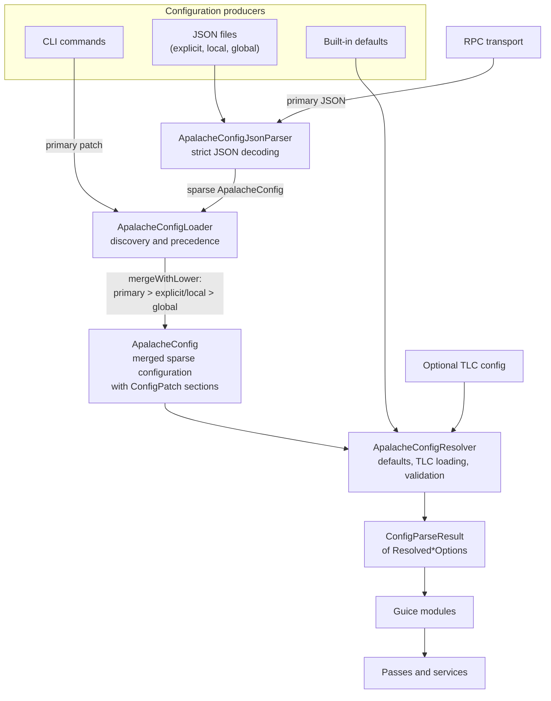

# ADR-026: Explicit configuration and command options

| authors     | last revised    |
|-------------| --------------: |
| Igor Konnov | 2026-07-30      |

**Table of Contents**

- [Summary (Overview)](#summary)
- [Context (Problem)](#context)
- [Solution (Decision)](#solution)
- [Consequences (Retrospection)](#consequences)

## Summary

[ADR-013][] and [ADR-022][] outlined the vision of unified configuration and
options management. The idea was to have one framework that parses and validates
the Apalache commands and options independently of how these commands are specified:
via CLI, via a configuration file, or via an RPC call. Nevertheless, we ran into
issues when maintaining and extending this framework, see [issue #2999][].

This ADR revisits the configuration framework and supersedes [ADR-013][] and
[ADR-022][].

## Context

This ADR is written with the following goals in mind:

 - The configuration code should be understandable without onboarding to
   non-standard frameworks and libraries. The code after [ADR-022][] had a number of
   workarounds for the idiosynchrasies of `pureconfig`.
 - If the framework uses a library, then this library should be stable and not *too opinionated*.
 - We prefer the well-known idioms, ideally, understandable by Java developers who
   had a bit of onboarding to Scala.

## Solution

**High-level decisions.** We make the following architectural decisions:

 - In contrast to [ADR-022][], **we no longer use `pureconfig` and `shapeless`**.
   These frameworks are relatively hard to understand for someone who does not work
   with the configuration code regularly. Their APIs are changing. In general, it looks
   like Scala frameworks are less maintained these days. Instead, **we use Jackson**.
   It's an old but a well-maintained Java library.
 - Instead of aiming for rich configuration formats (offered by HOCON), **we only accept
   JSON**: This format is simple, it requires zero onboarding, it can be parsed by
   plenty of libraries
 - We use **explicit parsing and validation code** instead of frameworks. As we learned
   with `pureconfig` and HOCON, the users still have to understand how these frameworks
   work, and the users have to accept the design decision of the framework authors.
   In the long run, explicit parsing and validation win over the frameworks.
 - **Configuration files shall be human-readable and human-writeable.** The configuration
   format of [ADR-022][] was mainly aiming at tools, e.g., the Quint tooling.
   In our experience, human-unfriendly formats cause too much friction and are too
   hard to debug. This time, it was no exception.
 - The configuration options **must be well-documented**. The configuration options
   of [ADR-022][] were not documented for the tool users, as the format was meant to be
   mainly a tool interchange format. As a result, it was hard to write a configuration file
   even after reading the source code.

**Interface boundaries.** The Apalache code interacts with the configuration framework along these points:

 - **Reasonable defaults.** These are the standard settings for the options
   that are not specified. These are the configuration **producers**.
 - **CLI commands.** These are command-line options that are specified by the user.
   CLI commands are configuration **producers**.
 - **JSON config.** This is a configuration file (or multiple files) that are written
   by the user or external tools. A configuration file must be expressive enough
   to replace CLI entirely. JSON configs are configuration **producers**.
 - **RPC calls.** These are RPC calls to the GRPC or JSON-RPC servers. Some of these
   calls may contain complete configurations that are equivalent to the CLI commands
   `parse`, `check`, and `simulate`. These calls act as **transport** between the
   configuration options and their consumers.
 - **Apalache passes.** The passes are the **consumers** of the configuration options.

**Concrete design.** As a result, we have rearchitected the configuration framework as follows:

 - Configuration loading and validation are organized into a single package
   `at.forsyte.apalache.io.config`.
 - The configuration model is captured in the class `ApalacheConfig`:
   - Partial configurations are captured with implementations of `ConfigPatch`.
     These partial configurations are organized around command-specific options
     or configuration sections.
   - Configuration patches can be merged together, specifying the precedence
     of one patch over another.
 - `ApalacheConfigJsonParser` reads the configuration file in JSON and produces
   an instance of `ApalacheConfig`. The parser is strict in that it rejects
   unknown fields.
 - `ApalacheConfigResolver` does command-specific validation of the options.
   It produces `Resolved*Options` for various consumers, e.g., it produces
   `ResolvedTypecheckOptions` for the type checker and `ResolvedCheckOptions`
   for the model checker.
 - `Resolved*Options` are injected into passes via Guice. No conversion or
   interface manipulation is required.
 - `ApalacheConfigLoader` is the entry point to the configuration framework
   that is used by the CLI tooling or RPC services.

The authoritative user-facing schema and discovery rules are specified in the
[configuration manual](../apalache/config.md).

The data flow of the configuration framework is shown below. Notice conceptual
similarities to [ADR-022][]. We follow the same vision, just implemented differently.

## Consequences

We hope that the refactored framework is easier to use and maintain in the
long-term.

[ADR-022]: ./022adr-unification-of-configs-and-options.md
[ADR-013]: ./013adr-configuration.md
[issue #2999]: https://github.com/apalache-mc/apalache/issues/2999
