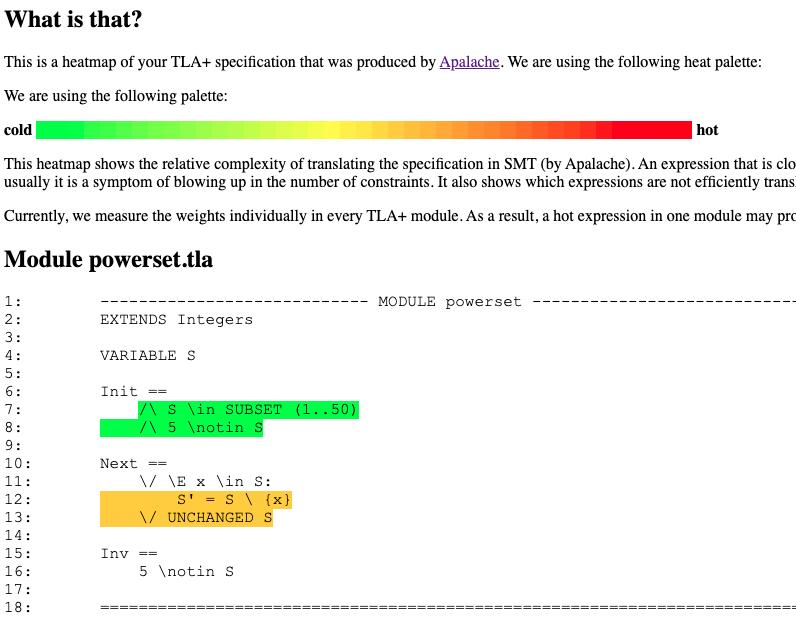
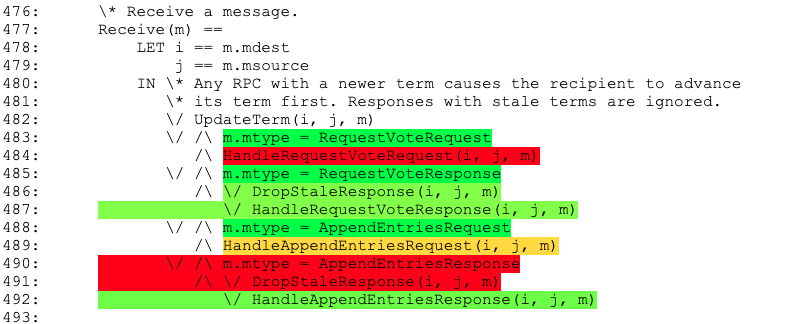

# Profiling Your Specification

As Apalache translates the TLA+ specification to SMT, it often defeats
our intuition about the standard bottlenecks that one learns about when running
TLC. For instance, whereas TLC needs a lot of time to compute the initial states
for the following specification, Apalache can check the executions of length up
to ten steps in seconds:

```tla
---------------------------- MODULE powerset ----------------------------
EXTENDS Integers
VARIABLE S

Init ==
    /\ S \in SUBSET (1..50)
    /\ 3 \notin S

Next ==
    \/ \E x \in S:
        S' = S \ {x}
    \/ UNCHANGED S

Inv ==
    3 \notin S
=========================================================================
```

Apalache has its own bottlenecks. As it's using the SMT solver z3,
we cannot precisely profile your TLA+ specification. However, we can profile
the number of SMT variables and constraints that Apalache produces for different
parts of your specification. To activate this profiling mode, use the option
`--smtprof`:

```sh
apalache check --smtprof powerset.tla
```

The profiling data is written in the file `profiler.csv`:

```
# weight,nCells,nConsts,nSmtExprs,location
4424,2180,2076,28460,powerset.tla:11:5-13:18
4098,2020,1969,12000,powerset.tla:12:9-12:20
4098,2020,1969,12000,powerset.tla:12:14-12:20
...
```

The meaning of the columns is as follows:

  * `weight` is the weight of the expression.
    Currently it is computed as `nCells + nConsts + sqrt(nSmtExprs)`.
    We may change this formula in the future.

  * `nCells` is the number of arena cells that are created during the translation.
    Intuitively, the cells are used to keep the potential shapes of the data structures
    that are captured by the expression.

  * `nConsts` is the number of SMT constants that are produced by the translator.

  * `nSmtExprs` is the number of SMT expressions that are produced by the translator.
    We also include all subexpressions, when counting this metric.

  * `location` is the location in the source code where the expression
     was found, indicated by the file name correlated with a range of `line:column` pairs.

To visualize the profiling data, you can use the script `script/heatmap.py`:

```sh
$APALACHE_HOME/script/heatmap.py profile.csv heatmap.html
```

The produced file `heatmap.html` looks as follows:




The heatmap may give you an idea about the expression that are hard for Apalache.
The following picture highlights one part of the Raft specification that produces
a lot of constraints:


