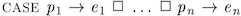
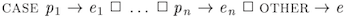

# Deterministic conditionals

[[Back to all operators]](./standard-operators.md)

In this section, we consider the instances of `IF-THEN-ELSE` and `CASE` that
may not update primed variables. For the case, when the operators inside
`IF-THEN-ELSE` or `CASE` can be used to do non-deterministic assignments, see
[Control Flow and Non-determinism](control-and-nondeterminism.md).

**Warning:** Because frequent use of `IF-THEN-ELSE` is very common in most
programming languages, TLA+ specification authors with programming experience
often default to writing expressions such as `IF A THEN B ELSE C`.  We
encourage those authors to use this construct more sparingly.  In our
experience, the use of `IF-THEN-ELSE` is rarely required.  Many things can be
done with [Boolean operators](./booleans.md), which provide more structure in
TLA+ code than in programming languages.  We recommend using `IF-THEN-ELSE` to
compute predicate-dependent values, not to structure code.

**Warning 2:** `CASE` is considered deterministic in this
section, as it is defined with the `CHOOSE` operator in
[Specifying Systems], Section 16.1.4.
For this reason, `CASE` should only be used when all of its guards are mutually exclusive.
Given all the intricacies of `CASE`,
we recommend using nested `IF-THEN-ELSE` instead.

----------------------------------------------------------------------------

<a name="ite"></a>
## Deterministic IF-THEN-ELSE

_Use it when choosing between two values, not to structure your code._

**Notation:** `IF A THEN B ELSE C`

**LaTeX notation:** the same

**Arguments:** a Boolean expression `A` and two expressions `B` and `C`

**Effect:** `IF A THEN B ELSE C` evaluates to:

 - The value of `B`, if `A` evaluates to `TRUE`.
 - The value of `C`, if `A` evaluates to `FALSE`.

**Determinism:** This is a deterministic version. For the non-deterministic
version, see [Control Flow and Non-determinism](control-and-nondeterminism.md).

**Errors:** If `A` evaluates to a non-Boolean value, the result is undefined.
TLC raises an error during model checking. Apalache raises a type error when
preprocessing. Additionally, if `B` and `C` may evaluate to values of different
types, Apalache raises a type error.

**Example in TLA+:** Consider the following TLA+ expression:

```tla
IF x THEN 100 ELSE 0
```

As you most likely expected, this expression evaluates to `100`, when `x`
evaluates to `TRUE`; and it evaluates to `0`, when `x` evaluates to `FALSE`.

**Example in Python:**

```tla
100 if x else 0
```

Note that we are using the expression syntax for `if-else` in python.
This is because we write an expression, not a series of statements that assign
values to variables!

<a name="case"></a>
## Deterministic CASE

_Read the description and never use this operator_

**Notation:**

```tla
CASE p_1 -> e_1
  [] p_2 -> e_2
  ...
  [] p_n -> e_n
```

**LaTeX notation:** 

**Arguments:** Boolean expressions `p_1, ..., p_n` and expressions `e_1, ...,
e_n`.

**Effect:** Given a state `s`, define the set `I \subseteq 1..n` as follows:
    The set `I` includes the index `j \in 1..n` if
    and only if `p_j` evaluates to `TRUE` in the state `s`.
Then the above `CASE` expression evaluates to:

  - the value of the expression `e_i` for some `i \in I`, if `I` is not empty; or
  - an undefined value, if the set `I` is empty.

As you can see, when several predicates `{p_i: i \in I}` are evaluated
to `TRUE` in the state `s`, then the result of `CASE` is equal to one of the
elements in the set `{e_i: i \in I}`. Although the result should be stable,
the exact implementation is unknown.

Whenever `I` is a singleton set, the result is easy to define: Just take the
only element of `I`. *Hence, when `p_1, ..., p_n` are mutually exclusive,
the result is deterministic and implementation-agnostic.*

Owing to the flexible semantics of simultaneously enabled predicates,
TLC interprets the above `CASE` operator as a chain of `IF-THEN-ELSE` expressions:

```tla
  IF p_1 THEN e_1
  ELSE IF p_2 THEN e_2
  ...
  ELSE IF p_n THEN e_n
  ELSE TLC!Assert(FALSE)
```

_As TLC fixes the evaluation order, TLC may miss a bug in an arm that is never
activated in this order!_

Note that the last arm of the ITE-series ends with `Assert(FALSE)`, as the
result is undefined, when no predicate evaluates to `TRUE`. As the type
of this expression cannot be precisely defined, Apalache does not support `CASE`
expressions, but only supports `CASE-OTHER` expressions (see below), which
it treats as a chain of `IF-THEN-ELSE` expressions.

**Determinism.** The result of `CASE` is deterministic, if there are no primes
inside.  For the non-deterministic version, see [[Control Flow and
Non-determinism]](control-and-nondeterminism.md).  When the predicates are
mutually exclusive, the evaluation result is clearly specified. When the predicates are
not mutually exclusive, the operator is still deterministic, but only one of
the simultaneously enabled branches is evaluated.
Which branch is evaluated depends on the `CHOOSE` operator, see [[Logic]](./logic.md).

**Errors:** If one of `p_1, ..., p_n` evaluates to a non-Boolean value, the
result is undefined.  TLC raises an error during model checking. Apalache
raises a type error when preprocessing. Additionally, if `e_1`, ..., `e_n`
may evaluate to values of different types, Apalache raises a type error.

**Example in TLA+:** The following expression classifies an integer variable
`n` with one of the three strings: "negative", "zero", or "positive".

```tla
  CASE n < 0 -> "negative"
    [] n = 0 -> "zero"
    [] n > 0 -> "positive"
```

Importantly, the predicates `n < 0`, `n = 0`, and `n > 0` are mutually
exclusive.

The following expression contains non-exclusive predicates:

```tla
  CASE n % 2 = 0 -> "even"
    [] (\A k \in 2..(1 + n \div 2): n % k /= 0) -> "prime"
    [] n % 2 = 1 -> "odd"

```

Note that by looking at the specification, we cannot tell, whether this
expression returns "odd" or "prime", when `n = 17`. We only know that the
case expression should consistently return the same value, whenever it is
evaluated with `n = 17`.

**Example in Python:** Consider our first example in TLA+. Similar to TLC, we
give executable semantics for the fixed evaluation order of the predicates.

```python
def case_example(n):
    if n < 0:
        return "negative"
    elif n == 0:
        return "zero"
    elif n > 0:
        return "positive"
```

<a name="caseOther"></a>
## Deterministic CASE-OTHER

_Better use IF-THEN-ELSE._

**Notation:**

```tla
CASE p_1 -> e_1
  [] p_2 -> e_2
  ...
  [] p_n -> e_n
  [] OTHER -> e_0
```

**LaTeX notation:** 

**Arguments:** Boolean expressions `p_1, ..., p_n` and expressions `e_0, e_1, ...,
e_n`.

**Effect:** This operator is equivalent to the following version of `CASE`:

```tla
CASE p_1 -> e_1
  [] p_2 -> e_2
  ...
  [] p_n -> e_n
  [] ~(p_1 \/ p_2 \/ ... \/ p_n) -> e_0
```

Both TLC and Apalache interpret this `CASE` operator as a chain of
`IF-THEN-ELSE` expressions:

```tla
  IF p_1 THEN e_1
  ELSE IF p_2 THEN e_2
  ...
  ELSE IF p_n THEN e_n
  ELSE e_0
```

All the idiosyncrasies of `CASE` apply to `CASE-OTHER`. Hence, we recommend
using `IF-THEN-ELSE` instead of `CASE-OTHER`. Although `IF-THEN-ELSE`
is a bit more verbose, its semantics are precisely defined.

**Determinism.** The result of `CASE-OTHER` is deterministic, if `e_0`, `e_1`,
..., `e_n` may not update primed variables.  For the non-deterministic version,
see [[Control Flow and Non-determinism]](control-and-nondeterminism.md).  When
the predicates are mutually exclusive, the semantics is clearly specified. When
the predicates are not mutually exclusive, the operator is still deterministic,
but only one of the simultaneously enabled branches is evaluated. The choice of
the branch is implemented with the operator `CHOOSE`, see
[[Logic]](./logic.md).

**Errors:** If one of `p_1, ..., p_n` evaluates to a non-Boolean value, the
result is undefined.  TLC raises an error during model checking. Apalache
raises a type error when preprocessing.  Additionally, if `e_0`, `e_1`, ...,
`e_n` may evaluate to values of different types, Apalache raises a type error.

[Specifying Systems]: http://lamport.azurewebsites.net/tla/book.html?back-link=learning.html
