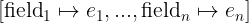

# Records

[[Back to all operators]](./standard-operators.md)

Records in TLA+ are special kinds of [functions](./functions.md) that have the
following properties:

 - The domain of a record contains only strings.
 - The domain of a record is finite.

That is it in pure TLA+. Essentially, TLA+ is following the duck-typing principle for
records: Any function over strings can be also treated as a record, and vice
versa, a record is also a function. So you can use all function operators on
records too.

**Construction.** TLA+ provides you with a convenient syntax for constructing
records.  For instance, the following example shows how to construct a record
that has two fields: Field `"a"` is assigned value `2`, and field `"b"` is
assigned value `TRUE`.

```tla
  [ a |-> 2, b |-> TRUE ]
```

Similar to the function set `[S -> T]`, there is a record set constructor:

```tla
  [ name: { "Alice", "Bob" }, year_of_birth: 1900..2000 ]
```

The expression in the above example constructs a set of records that have: the
`name` field set to either "Alice" or "Bob", and the `year_of_birth` field set
to an integer from 1900 to 2000.

**Application.** TLA+ provides you with a shorthand operator for accessing
a record field by following C-style struct-member notation. For example:

```tla
  r.myField
```

This is essentially syntax sugar for `r["myField"]`.

**Immutability**. As records are special kinds of [functions](./functions.md),
records are immutable.

**Types.** In contrast to pure TLA+ and TLC, the Apalache model checker
distinguishes between general functions and records. When Apalache processes a
record constructor, it assigns the record type to the result. This record type
carries the information about the names of the record fields and their types.
Similarly, Apalache assigns the type of a set of records, when it processes a
record set constructor.  See the [Apalache ADR002][] on types.

_Owing to the type information, records are translated into SMT more efficiently
by Apalache than the general functions._

Every record is assigned a type in Apalache. For instance, the record
`[name |-> "A", a |-> 3]` has the type `{ name: Str, a: Int }`. In contrast to
TLC, the type checker statically flags an error, if a spec is trying to access
a non-existent field. Consider the following example:

```tla
{{#include ../../../test/tla/TestUnsafeRecord.tla}}
```

If we run the type checker, it will immediately find unsafe record access:

```sh
$ apalache-mc typecheck TestUnsafeRecord.tla
...
[TestUnsafeRecord.tla:6:17-6:19]: Cannot apply R() to the argument "b" in R()["b"]
```

Sometimes, record types can get tricky, when operators in a spec only have
partial type information. For example, consider operator `GetX`:

```tla
{{#include ../../../test/tla/TestGetX.tla}}
```

If we run the type checker, it will complain about not being able to infer
the type of `r`:

```sh
$ apalache-mc typecheck TestGetX.tla
...
[TestGetX.tla:2:12-2:14]: Cannot apply r to the argument "x" in r["x"].
```

The reason is simple: The type checker could not decide, whether `r` was a
record or a function. Even if we knew that `r` was a record, what type should
it have? Luckily, the Apalache type checker supports [Row polymorphism][].
Hence, we can specify the type of `r` as follows:


```tla
{{#include ../../../test/tla/TestGetXWithRows.tla}}
```

In the type annotation, we are saying that `r` is a record that has the field
`x` of some type `a` (which we don't know), and the rest of the record does not
matter. This matches our intuition about the behavior of `GetX`. This time the
type checker does not complain:

```sh
$ apalache-mc typecheck TestGetXWithRows.tla
...
Type checker [OK]
```

In untyped TLA+, it is common to mix records of different shapes into sets. For
instance, see how the variable `msgs` is updated in [Paxos][]. It is not
possible to do so with records in Apalache. To address this pattern, Apalache
supports [Variants][].

----------------------------------------------------------------------------

## Operators

In the Python examples, we are using the package [frozendict], to produce an
immutable dictionary.

----------------------------------------------------------------------------

<a name="recCtor"></a>
### Record constructor

**Notation:** `[ field_1 |-> e_1, ..., field_n |-> e_n]`

**LaTeX notation:** 

**Arguments:** An even number of arguments: field names and field values,
interleaved. At least one field is expected. Note that field names are TLA+
identifiers, not strings.

**Apalache type:** `(a_1, ..., a_n) => { field_1: a_1, ..., field_n: a_n }`, for
some types `a_1, ..., a_n`.

**Effect:** The record constructor returns a function `r` that is constructed
as follows:

 - set `DOMAIN r` to `{ field_1, ..., field_n }`,
 - set `r[field_i]` to the value of `e_i` for `i \in 1..n`.

**Determinism:** Deterministic.

**Errors:** No errors.

**Example in TLA+:**

```tla
  [ name |-> "Printer", port |-> 631 ]
    \* A record that has two fields:
    \* field "name" that is equal to "Printer", and field "port" that is equal to 631.
```

**Example in Python:**

```python
>>> { "name": "Printer", "port": 631 }
{'name': 'Printer', 'port': 631}

```

----------------------------------------------------------------------------

<a name="recSetCtor"></a>
### Record set constructor

**Notation:** `[ field_1: S_1, ..., field_n: S_n]`

**LaTeX notation:** 

**Arguments:** An even number of arguments: field names and field values,
interleaved. At least one field is expected. Note that field names are TLA+
identifiers, not strings.

**Apalache type:** `(Set(a_1), ..., Set(a_n)) => Set({ field_1: a_1, ...,
field_n: a_n })`, for some types `a_1, ..., a_n`.

**Effect:** The record set constructor `[ field_1: S_1, ..., field_n: S_n]`
is syntax sugar for the set comprehension:

```tla
{ [ field_1 |-> e_1, ..., field_n |-> e_n]: e_1 \in S_1, ..., e_n \in S_n }
```

**Determinism:** Deterministic.

**Errors:** The arguments `S_1, ..., S_n` must be sets. If they are not sets,
the result is undefined in pure TLA+. TLC raises a model checking error. Apalache
flags a static type error.

TLC raises a model checking error, whenever one of the sets `S_1, ..., S_n` is
infinite. Apalache can handle infinite records sets in some cases, when one record
is picked with `\E r \in [ field_1: S_1, ..., field_n: S_n]`.

**Example in TLA+:**

```tla
  [ name: { "A", "B", "C" }, port: 1..65535 ]
    \* A set of records. Each has two fields:
    \* field "name" that has the value from the set { "A", "B", "C" }, and
    \* field "port" that has the value from the set 1..65535.
```

**Example in Python:** TLA+ functions are immutable, so we are using [frozendict]:

```python
  frozenset({ frozendict({ "name": n, "port": p })
                for n in { "A", "B", "C" } for p in range(1, 65535 + 1) })
```

----------------------------------------------------------------------------

<a name="recApp"></a>
### Access by field name

**Notation:** `r.field_i`

**LaTeX notation:** `r.field_i`

**Arguments:** Two arguments: a record and a field name (as an identifier).

**Apalache type:** `{ field_i: a, b } => b`, for some types `a` and `b`
(technically, `b` is a row that captures the other fields).

Note that `r.field_i` is just a syntax sugar for `r["field_i"]` in TLA+.
Hence, if the Apalache type checker cannot choose between `r` being a record or
a function, the type checker fails with a type error. In this case, you have to
type-annotate the definition that contains `r`.

**Effect:** As records are also functions, this operator works as `r["field_i"]`.

Apalache treats records as values of a record type. In comparison to the
general function application `r["field"]`, the operator `r.field` is handled
much more efficiently in Apalache. Due to the use of types, Apalache can
extract the respective field when translating the access expression into SMT.

**Determinism:** Deterministic.

**Example in TLA+:**

```tla
  LET r == [ name |-> "Printer", port |-> 631 ] IN
  r.name    \* "Printer"
```

**Example in Python:**

```python
>>> r = { "name": "Printer", "port": 631 }
>>> r["name"]
'Printer'

```

----------------------------------------------------------------------------

[Control Flow and Non-determinism]: ./control-and-nondeterminism.md
[Specifying Systems]: http://lamport.azurewebsites.net/tla/book.html?back-link=learning.html
[frozendict]: https://pypi.org/project/frozendict/
[Paxos]: https://github.com/tlaplus/Examples/blob/master/specifications/Paxos/Paxos.tla
[Apalache ADR002]: ../adr/002adr-types.md
[Variants]: ./variants.md
[Row polymorphism]: https://en.wikipedia.org/wiki/Row_polymorphism
