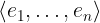
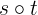

# Sequences

[[Back to all operators]](./standard-operators.md)

On the surface, TLA+ sequences are very much like lists in your programming
language of choice.  If you are writing code in Java, Python, Lisp, C++, Scala,
you will be tempted to use sequences in TLA+ too. This is simply due to the
fact that arrays, vectors, and lists are the most efficient collections in
programming languages (for many tasks, but not all of them). But TLA+ is not
about efficient compilation of your data structures!  Many algorithms can be
expressed in a much nicer way with [sets](./sets.md) and
[functions](./functions.md). In general, use sequences when you really need
them.

In pure TLA+, sequences are just [tuples](./tuples). As a tuple, a sequence is
a function of the domain `1..n` for some `n >= 0` (the domain may be empty).
The duck-typing principle applies to sequences too: Any function with the domain `1..n` can also be
treated as a sequence (or a tuple), and vice versa, tuples and sequences are
also functions. So you can use all function and tuple operators on sequences.

Importantly, the domain of a sequence is `1..n` for some `n >= 0`. So the
indices in a sequence start with 1, not 0. For instance, `<<1, 2>>[1]` gives us
1, whereas `<<1, 2>>[2]` gives us 2.

The operators on sequences are defined in the standard module `Sequences`. To
use it, write the `EXTENDS` clause in the first lines of your module. Like
this:

```tla
------ MODULE MyLists ----====
EXTENDS Sequences
...
==============================
```

**Construction.** Sequences are constructed exactly as tuples in TLA+:

```tla
  <<2, 4, 8>>
```

Sometimes, you have to talk about all possible sequences. The operator
`Seq(S)` constructs the set of all (finite) sequences that draw elements
from the set `S`. For instance, `<<1, 2, 2, 1>> \in Seq({1, 2, 3})`.
Note that `Seq(S)` is an infinite set. To use it with TLC, you often have
to override this operator, see [Specifying Systems], page 237.

**Application.** Simply use function application, e.g., `s[2]`.

**Immutability.** As sequences are special kinds of
[functions](./functions.md), sequences are immutable.

**Sequence operators.** The module `Sequences` provides you with convenient
operators on sequences:

  - Add to end: `Append(s, e)`
  - First and rest: `Head(s)` and `Tail(s)`
  - Length: `Len(s)`
  - Concatenation: `s \o t`
  - Subsequence: `SubSeq(s, i, k)`
  - Sequence filter: `SelectSeq(s, Test)`

See the detailed description in **Operators**.

**Types.** In contrast to pure TLA+ and TLC, the Apalache model checker
distinguishes between general functions, tuples, and sequences. They all have
different types. Essentially, a function has the type `T_1 -> T_2` that
restricts the arguments and results as follows: the arguments have the type
`T_1` and the results have the type `T_2`. A sequence has the type `Seq(T_3)`,
which restricts the sequence elements to have the same type `T_3`.

As sequences are also tuples in TLA+, this poses a challenge for the Apalache
type checker. For instance, it can immediately figure out that `<<1, "Foo">>`
is a tuple, as Apalache does not allow sequences to carry elements of different
types. However, there is no way to say, whether `<<1, 2, 3>>` should be treated
as a tuple or a sequence.  Usually, this problem is resolved by annotating the
type of a variable or the type of a user operator. See [HOWTO write type
annotations][].

_The current SMT encoding of sequences in Apalache is not optimized,
so operations on sequences are often significantly slower than operations
on sets._

----------------------------------------------------------------------------

## Operators


<a name="seqCtor"></a>
### Tuple/Sequence constructor

**Notation:** `<<e_1, ..., e_n>>`

**LaTeX notation:** 

**Arguments:** An arbitrary number of arguments.

**Apalache type:** This operator is overloaded. There are two potential types:

  1. A tuple constructor: `(a_1, ..., a_n) => <<a_1, ..., a_n>>`,
    for some types `a_1, ..., a_n`.
  1. A sequence constructor: `(a, ..., a) => Seq(a)`, for some type `a`.

That is why the Apalache type checker is sometimes asking you to add annotations,
in order to resolve this ambiguity.

**Effect:** The tuple/sequence constructor returns a function `t` that is
constructed as follows:

 - set `DOMAIN t` to `1..n`,
 - set `r[i]` to the value of `e_i` for `i \in 1..n`.

In Apalache, this constructor may be used to construct either a tuple, or a
sequence. To distinguish between them, you will sometimes need a [type
annotation].

**Determinism:** Deterministic.

**Errors:** No errors.

**Example in TLA+:**

```tla
  <<"Printer", 631>>
```

**Example in Python:** Python provides us with the syntax for constructing
lists, which are indexed with 0!. If we want to stick to the
principle "sequences are functions", we have to use a dictionary.

```python
>>> ["Printer", 631]          # the pythonic way, a two-element list
['Printer', 631]
>>> { 1: "Printer", 2: 631 }  # the "sequences-are-functions" way
{1: 'Printer', 2: 631}

```

----------------------------------------------------------------------------

<a name="append"></a>
### Sequence append

**Notation:** `Append(seq, e)`

**LaTeX notation:** `Append(seq, e)`

**Arguments:** Two arguments. The first argument should be a sequence, the
second one is an arbitrary expression.

**Apalache type:** `(Seq(a), a) => Seq(a)`, for some type `a`.

**Effect:** The operator `Append(seq, e)`
constructs a new sequence `newSeq` as follows:

 - set `DOMAIN newSeq` to be `(DOMAIN seq) \union { Len(seq) + 1 }`.
 - set `newSeq[i]` to `seq[i]` for `i \in 1..Len(seq)`.
 - set `newSeq[Len(seq) + 1]` to `e`.

**Determinism:** Deterministic.

**Errors:** The argument `seq` must be a sequence, that is, a function over
integers `1..n` for some `n`. Otherwise, the result is undefined in pure TLA+.
TLC raises a model checking error. Apalache flags a static type error.

Apalache flags a static type error, when the type of `e` is not compatible with
the type of the sequence elements.

**Example in TLA+:**

```tla
  Append(<<1, 2>>, 5)
    \* The sequence <<1, 2, 5>>
```

**Example in Python:**

```python
>>> # the pythonic way: a list (indexed with 0, 1, ...)
>>> l = [ 1, 2 ]
>>> l.append(5)
>>> l
[1, 2, 5]
>>> # the TLA+ way
>>> l = { 1: 1, 2: 2 }
>>> { i: l[i] if i <= len(l) else 5
...   for i in range(1, len(l) + 2) }
{1: 1, 2: 2, 3: 5}

```

----------------------------------------------------------------------------

<a name="app"></a>
### Function application

As sequences are functions, you can access sequence elements with [function
application](./functions.md#funApp), e.g., `seq[2]`.  However, in the case of a
sequence, the type of the function application is: `(Seq(a), Int) => a`, for
some type `a`.

----------------------------------------------------------------------------

<a name="head"></a>
### Sequence head

**Notation:** `Head(seq)`

**LaTeX notation:** `Head(seq)`

**Arguments:** One argument. The argument should be a sequence (or a tuple).

**Apalache type:** `Seq(a) => a`, for some type `a`.

**Effect:** The operator `Head(seq)` evaluates to `seq[1]`.
If `seq` is an empty sequence, the result is undefined.

**Determinism:** Deterministic.

**Errors:** The arguments `seq` must be a sequence (or a tuple), that is, a
function over integers `1..n` for some `n`. Otherwise, the result is undefined
in pure TLA+. TLC raises a model checking error. Apalache flags a static type
error.

**Example in TLA+:**

```tla
  Head(<<3, 4>>)
    \* 3
```

**Example in Python:**

```python
>>> # the pythonic way: using the list
>>> l = [ 3, 4 ]
>>> l[0]
3
>>> # the TLA+ way
>>> l = { 1: 3, 2: 4 }
>>> l[1]
3

```

----------------------------------------------------------------------------

<a name="tail"></a>
### Sequence tail

**Notation:** `Tail(seq)`

**LaTeX notation:** `Tail(seq)`

**Arguments:** One argument. The argument should be a sequence (or a tuple).

**Apalache type:** `Seq(a) => Seq(a)`, for some type `a`.

**Effect:** The operator `Tail(seq)` constructs a new sequence `newSeq` as
follows:

 - set `DOMAIN newSeq` to be `(DOMAIN seq) \ { Len(seq) }`.
 - set `newSeq[i]` to `seq[i + 1]` for `i \in 1..(Len(seq) - 1)`.

If `seq` is an empty sequence, the result is undefined.

Apalache encodes a sequences as a triple `<<fun, start, end>>`, where
`start` and `end` define a slice of the function `fun`. As a result,
`Tail` is a very simple operation that just increments `start`.

**Determinism:** Deterministic.

**Errors:** The arguments `seq` must be a sequence (or a tuple), that is, a
function over integers `1..n` for some `n`. Otherwise, the result is undefined
in pure TLA+. TLC raises a model checking error. Apalache flags a static type
error.

**Example in TLA+:**

```tla
  Tail(<<3, 4, 5>>)
    \* <<4, 5>>
```

**Example in Python:**

```python
>>> # the pythonic way: using the list
>>> l = [ 3, 4, 5 ]
>>> l[1:]
[4, 5]
>>> # the TLA+ way
>>> l = { 1: 3, 2: 4, 3: 5 }
>>> { i: l[i + 1] for i in range(1, len(l)) }
{1: 4, 2: 5}

```

----------------------------------------------------------------------------

<a name="len"></a>
### Sequence length

**Notation:** `Len(seq)`

**LaTeX notation:** `Len(seq)`

**Arguments:** One argument. The argument should be a sequence (or a tuple).

**Apalache type:** `Seq(a) => Int`, for some type `a`.

**Effect:** The operator `Len(seq)` is semantically equivalent to
`Cardinality(DOMAIN seq)`.

Apalache encodes a sequences as a triple `<<fun, start, end>>`, where
`start` and `end` define a slice of the function `fun`. As a result,
`Len` is simply computed as `end - start`.

**Determinism:** Deterministic.

**Errors:** The argument `seq` must be a sequence (or a tuple), that is, a
function over integers `1..n` for some `n`. Otherwise, the result is undefined
in pure TLA+. TLC raises a model checking error. Apalache flags a static type
error.

**Example in TLA+:**

```tla
  Len(<<3, 4, 5>>)
    \* 3
```

**Example in Python:**

```python
>>> # the pythonic way: using the list
>>> l = [ 3, 4, 5 ]
>>> len(l)
3
>>> # the TLA+ way
>>> l = { 1: 3, 2: 4, 3: 5 }
>>> len(l.keys())
3

```

----------------------------------------------------------------------------

<a name="concat"></a>
### Sequence concatenation

**Notation:** `s \o t` (or `s \circ t`)

**LaTeX notation:** 

**Arguments:** Two arguments: both should be sequences (or tuples).

**Apalache type:** `(Seq(a), Seq(a)) => Seq(a)`, for some type `a`.

**Effect:** The operator `s \o t`
constructs a new sequence `newSeq` as follows:

 - set `DOMAIN newSeq` to be `1..(Len(s) + Len(t))`.
 - set `newSeq[i]` to `s[i]` for `i \in 1..Len(s)`.
 - set `newSeq[Len(s) + i]` to `t[i]` for `i \in 1..Len(t)`.

**Determinism:** Deterministic.

**Errors:** The arguments `s` and `t` must be sequences, that is, functions
over integers `1..n` and `1..k` for some `n` and `k`. Otherwise, the result is
undefined in pure TLA+. TLC raises a model checking error. Apalache flags a
static type error.

Apalache flags a static type error, when the types of `s` and `t` are
incompatible.

**Example in TLA+:**

```tla
  <<3, 5>> \o <<7, 9>>
    \* The sequence <<3, 5, 7, 9>>
```

**Example in Python:**

```python
>>> # the pythonic way: a list (indexed with 0, 1, ...)
>>> l1 = [ 3, 5 ]
>>> l2 = [ 7, 9 ]
>>> l1 + l2
[3, 5, 7, 9]
>>> # the TLA+ way
>>> l1 = { 1: 3, 2: 5 }
>>> l2 = { 1: 7, 2: 9 }
>>> { i: l1[i] if i <= len(l1) else l2[i - len(l1)]
...    for i in range(1, len(l1) + len(l2) + 1) }
{1: 3, 2: 5, 3: 7, 4: 9}

```

----------------------------------------------------------------------------

<a name="subseq"></a>
### Subsequence

**Notation:** `SubSeq(seq, m, n)`

**LaTeX notation:** `SubSeq(seq, m, n)`

**Arguments:** Three arguments: a sequence (tuple), and two integers.

**Apalache type:** `(Seq(a), Int, Int) => Seq(a)`, for some type `a`.

**Effect:** The operator `SubSeq(seq, m, n)`
constructs a new sequence `newSeq` as follows:

 - set `DOMAIN newSeq` to be `1..(n - m)`.
 - set `newSeq[i]` to `s[m + i - 1]` for `i \in 1..(n - m + 1)`.

If `m > n`, then `newSeq` is equal to the empty sequence `<< >>`.
If `m < 1` or `n > Len(seq)`, then the result is undefined.

**Determinism:** Deterministic.

**Errors:** The argument `seq` must be a sequence, that is, a function over
integers `1..k` for some `k`. The arguments `m` and `n` must be integers.
Otherwise, the result is undefined in pure TLA+. TLC raises a model checking
error. Apalache flags a static type error.

**Example in TLA+:**

```tla
  SubSeq(<<3, 5, 9, 10>>, 2, 3)
    \* The sequence <<5, 9>>
```

**Example in Python:**

```python
>>> # the pythonic way: a list (indexed with 0, 1, ...)
>>> l = [ 3, 5, 9, 10 ]
>>> l[1:3]
[5, 9]
>>> # the TLA+ way
>>> l = { 1: 3, 2: 5, 3: 9, 4: 10 }
>>> m = 2
>>> n = 3
>>> { i: l[i + m - 1]
...   for i in range(1, n - m + 2) }
{1: 5, 2: 9}

```

----------------------------------------------------------------------------

<a name="filter"></a>
### Sequence filter

**Notation:** `SelectSeq(seq, Test)`

**LaTeX notation:** `SelectSeq(seq, Test)`

**Arguments:** Two arguments: a sequence (a tuple) and a one-argument
operator that evaluates to `TRUE` or `FALSE` when called with
an element of `seq` as its argument.

**Apalache type:** `(Seq(a), (a => Bool)) => Seq(a)`, for some type `a`.

**Effect:** The operator `SelectSeq(seq, Test)` constructs a new sequence
`newSeq` that contains every element `e` of `seq` on which `Test(e)` evaluates
to `TRUE`.

It is much easier to describe the effect of `SelectSeq` in words than to
give a precise sequence of steps. See **Examples**.

_This operator is not supported by Apalache, as it inlines all operators,
before translating the specification in SMT. Hence, it cannot pass `Test`
into a built-in operator. To work around it, write a user-defined
recursive operator that is equivalent to `SelectSeq`._

**Determinism:** Deterministic.

**Errors:** If the arguments are not as described in **Arguments**, then the
result is undefined in pure TLA+. TLC raises a model checking error.

**Example in TLA+:**

```tla
  LET Test(x) ==
    x % 2 = 0
  IN
  SelectSeq(<<3, 4, 9, 10, 11>>, Test)
    \* The sequence <<4, 10>>
```

**Example in Python:**

```python
>>> # the pythonic way: a list (indexed with 0, 1, ...)
>>> def test(x):
...   return x % 2 == 0
>>>
>>> l = [ 3, 4, 9, 10, 11 ]
>>> [ x for x in l if test(x) ]
[4, 10]

>>> # the TLA+ way
>>> l = { 1: 3, 2: 4, 3: 9, 4: 10, 5: 11 }
>>> as_list = sorted(list(l.items()))
>>> filtered = [ x for (_, x) in as_list if test(x) ]
>>> { i: x
...   for (i, x) in zip(range(1, len(filtered) + 1), filtered)
... }
{1: 4, 2: 10}

```

----------------------------------------------------------------------------

<a name="seq"></a>
### All sequences

**Notation:** `Seq(S)`

**LaTeX notation:** `Seq(S)`

**Arguments:** One argument that should be a set.

**Apalache type:** `Set(a) => Set(Seq(a))`, for some type `a`.

**Effect:** The operator `Seq(S)` constructs the set of all (finite) sequences
that contain elements from `S`. This set is infinite.

It is easy to give a recursive definition of all sequences whose length
is bounded by some `n >= 0`:

```tla
RECURSIVE BSeq(_, _)
BSeq(S, n) ==
  IF n = 0
  THEN {<< >>}  \* the set that contains the empty sequence
  ELSE LET Shorter == BSeq(S, n - 1) IN
        Shorter \union { Append(seq, x): seq \in Shorter, x \in S }
```

Then we can define `Seq(S)` to be `UNION { BSeq(S, n): n \in Nat }`.

**Determinism:** Deterministic.

**Errors:** The argument `S` must be a set.
Apalache flags a static type error, if `S` is not a set.

TLC raises a model checking error, when it meets `Seq(S)`, as `Seq(S)` is
infinite. You can override `Seq(S)` with its bounded version `BSeq(S, n)`
for some `n`. See: [Overriding Seq in TLC].

Apalache does not support `Seq(S)` yet. As a workaround, you can manually
replace `Seq(S)` with `BSeq(S, n)` for some constant `n`.  See the progress in
[Issue 314](https://github.com/informalsystems/apalache/issues/314).

**Example in TLA+:**

```tla
  Seq({1, 2, 3})
    \* The infinite set
      { <<>>,
        <<1>>, <<2>>, <<3>>,
        <<1, 1>>, <<1, 2>>, <<1, 3>>,
            <<2, 1>>, <<2, 2>>, <<2, 3>>, <<3, 1>>, <<3, 2>>, <<3, 3>>
        ...
      }
```

**Example in Python:** We cannot construct an infinite set in Python. However,
we could write an iterator that enumerates the sequences in `Seq(S)`
till the end of the universe.


[Control Flow and Non-determinism]: ./control-and-nondeterminism.md
[Specifying Systems]: http://lamport.azurewebsites.net/tla/book.html?back-link=learning.html
[Paxos]: https://github.com/tlaplus/Examples/blob/master/specifications/Paxos/Paxos.tla
[Apalache ADR002]: https://github.com/informalsystems/apalache/blob/unstable/docs/adr/002adr-types.md
[Cartesian product]: https://en.wikipedia.org/wiki/Cartesian_product
[Overriding Seq in TLC]: https://groups.google.com/g/tlaplus/c/sYx_6e3YyWk/m/4CnwPqIVAgAJ
[HOWTO write type annotations]: ../../HOWTOs/howto-write-type-annotations.md
