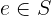
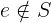
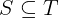
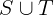
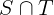
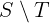
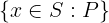
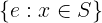

# Sets

[[Back to all operators]](./standard-operators.md)

Sets are the foundational data structure in TLA+. (Similar to what lists are in
Lisp and Python). The other TLA+ data structures can be all expressed with
sets: functions, records, tuples, sequences. In theory, even Booleans and
integers can be expressed with sets. In practice, TLA+ tools treat Booleans and
integers as special values that are different from sets. It is important to
understand TLA+ sets well. In contrast to programming languages, there is no
performance penalty for using sets instead of sequences: TLA+ does not have a
compiler, the efficiency is measured in the time it takes the human brain to
understand the specification.

**Immutability.** In TLA+, a set is an *immutable* data structure that stores
its elements in *no particular order*. All elements of a set are unique. In
fact, those two sentences do not make a lot of sense in TLA+. We have written
them to build the bridge from a programming language to TLA+, as TLA+ does not
have a memory model. :wink:

Sets may be constructed by enumerating values in *some order*, allowing for
duplicates:

```tla
  { 1, 2, 3, 2, 4, 3 }
```

Note that the above set is equal to the sets `{ 1, 2, 3, 4 }` and `{ 4, 3, 2, 1
}`. They are actually the same set, though they are constructed by passing
various number of arguments in different orders.

The most basic set operation is the set membership that checks, whether a set
contains a value:

```tla
  3 \in S
```

TLA+ sets are similar to
[`frozenset`](https://docs.python.org/3/library/stdtypes.html#frozenset) in
Python and immutable `Set[Object]` in Java.  In contrast to programming
languages, set elements do not need hashes, as implementation efficiency is not
an issue in TLA+.

**Types.** In pure TLA+, sets may contain any kinds of elements. For instance,
a set may mix integers, Booleans, and other sets:

```tla
  { 2020, { "is" }, TRUE, "fail" }
```

TLC restricts set elements to comparable values. See Section 14.7.2 of
[Specifying Systems]. In a nutshell, if you do not mix the following five
kinds of values in a single set, TLC would not complain about your sets:

 1. Booleans,
 1. integers,
 1. strings,
 1. sets,
 1. functions, tuples, records, sequences.


Apalache requires set elements to have the same type, that is, `Set(a)` for
some type `a`. This is enforced by the type checker.  (Records are an exception
to this rule, as some records can be unified to a common type.) 

----------------------------------------------------------------------------

## Operators

<a name="setEnum"></a>
### Set constructor by enumeration

**Notation:** `{e_1, ..., e_n}`

**LaTeX notation:** `{e_1, ..., e_n}`

**Arguments:** Any number of arguments, `n >= 0`.

**Apalache type:** `(a, ..., a) => Set(a)`, for some type `a`.

**Effect:** Produce the set that contains the values of the expressions `e_1,
..., e_n`, in no particular order, and only these values. If `n = 0`, the
empty set is constructed.

**Determinism:** Deterministic.

**Errors:** Pure TLA+ does not restrict the set elements. They can be any
combination of TLA+ values: Booleans, integers, strings, sets, functions, etc.

TLC only allows a user to construct sets out of elements that are comparable. For
instance, two integers are comparable, but an integer and a set are not
comparable. See Section 14.7.2 of [Specifying Systems].

Apalache goes further and requires that all set elements have the same type.
If this is not the case, the type checker flags an error.

**Example in TLA+:**

```tla
  { 1, 2, 3 }               \* a flat set of integers
  { { 1, 2 }, { 2, 3 } }    \* a set of sets of integers
  { FALSE, 1 }              \* a set of mixed elements.
                            \* Model checking error in TLC, type error in Apalache
```

**Example in Python:** TLA+ sets are immutable, so we are using `frozenset`:

```python
  frozenset({1, 2, 3})
  frozenset({frozenset({1, 2}), frozenset({2, 3})})
  frozenset({False, 1})
```

----------------------------------------------------------------------------

<a name="in"></a>
### Set membership

**Notation:** `e \in S`

**LaTeX notation:** 

**Arguments:** Two arguments.  If the second argument is not a set, the result
is undefined.

**Apalache type:** `(a, Set(a)) => Bool`, for some type `a`.

**Effect:** This operator evaluates to:

  - `TRUE`, if `S` is a set that contains an element that is equal to the value
    of `e`; and
  - `FALSE`, if `S` is a set and all of its elements are not equal to the
    value of `e`.

*Warning:* If you are using the special form `x' \in S`, this operator may
assign a value to `x'` as a side effect. See [Control Flow and Non-determinism].

**Determinism:** Deterministic, unless you are using the special form `x' \in
S` to assign a value to `x'`, see [Control Flow and Non-determinism].

**Errors:** Pure TLA+ does not restrict the operator arguments.  TLC flags a
model checking error, when it discovers that `e` cannot be compared to the
elements of `S`. Apalache produces a static type error, if the type of `e` is
incompatible with the type of elements of `S`, or if `S` is not a set.

**Example in TLA+:**

```tla
   1 \in { 1, 2, 3 }        \* TRUE
  10 \in { 1, 2, 3 }        \* FALSE
  {} \in { {1}, {2} }       \* FALSE
   1 \in { "a", "b" }       \* model checking error in TLC,
                            \* static type error in Apalache
```

**Example in Python:** Python conveniently offers us `in`:

```python
  1 in frozenset({1, 2, 3})     # True
  10 in frozenset({1, 2, 3})    # False
  1 in frozenset({"a", "b"})    # False
```

----------------------------------------------------------------------------

<a name="notin"></a>
### Set non-membership

**Notation:** `e \notin S`

**LaTeX notation:** 

**Arguments:** Two arguments.  If the second argument is not a set, the result
is undefined.

**Apalache type:** `(a, Set(a)) => Bool`, for some type `a`.

**Effect:** This operator evaluates to:

  - `FALSE`, if `S` is a set that contains an element that is equal to the value
    of `e`; and
  - `TRUE`, if `S` is a set and all of its elements are not equal to the
    value of `e`.

*Warning:* In contrast to `x' \in S`, the expression `x' \notin T`,
which is equivalent to `~(x' \in T)` is never
treated as an assignment in Apalache and TLC.

**Determinism:** Deterministic.

**Errors:** Pure TLA+ does not restrict the operator arguments.  TLC flags a
model checking error, when it discovers that `e` cannot be compared to the
elements of `S`. Apalache produces a static type error, if the type of `e` is
incompatible with the type of elements of `S`, or if `S` is not a set.

**Example in TLA+:**

```tla
   1 \notin { 1, 2, 3 }     \* FALSE
  10 \notin { 1, 2, 3 }     \* TRUE
  {} \notin { {1}, {2} }    \* TRUE
   1 \notin { "a", "b" }    \* model checking error in TLC,
                            \* static type error in Apalache
```

**Example in Python:** Python conveniently offers us `not in`:

```python
  1 not in frozenset({1, 2, 3})     # False
  10 not in frozenset({1, 2, 3})    # True
  1 not in frozenset({"a", "b"})    # True
```

----------------------------------------------------------------------------

<a name="eq"></a>
### Equality and inequality

The operators `a = b` and `a /= b` are core operators of TLA+,
see [Logic](./logic.md).

----------------------------------------------------------------------------

<a name="subseteq"></a>
### Set inclusion

**Notation:** `S \subseteq T`

**LaTeX notation:** 

**Arguments:** Two arguments.  If both arguments are not sets, the result
is undefined.

**Apalache type:** `(Set(a), Set(a)) => Bool`, for some type `a`.

**Effect:** This operator evaluates to:

  - `TRUE`, if `S` and `T` are sets, and every element of `S` is a member of `T`;
  - `FALSE`, if `S` and `T` are sets, and there is an element of `S` that
    is not a member of `T`.

**Determinism:** Deterministic.

**Errors:** Pure TLA+ does not restrict the operator arguments.  TLC flags a
model checking error, when it discovers that elements of `S` cannot be compared
to the elements of `T`. Apalache produces a static type error, `S` and `T` are
either not sets, or sets of incompatible types.

**Example in TLA+:**

```tla
     { 1, 2 } \subseteq { 1, 2, 3 }     \* TRUE
  { 1, 2, 3 } \subseteq { 1, 2, 3 }     \* TRUE
  { 1, 2, 3 } \subseteq { 1, 2 }        \* FALSE
      { {1} } \subseteq { 1, 2, 3 }     \* FALSE, model checking error in TLC
                                        \* static type error in Apalache
```

**Example in Python:** Python conveniently offers us `<=`:

```python
  frozenset({1, 2}) <= frozenset({1, 2, 3})             # True
  frozenset({1, 2, 3}) <= frozenset({1, 2, 3})          # True
  frozenset({1, 2, 3}) <= frozenset({1, 2})             # False
  frozenset({frozenset({1})}) <= frozenset({1, 2, 3})   # False
```

----------------------------------------------------------------------------

<a name="union"></a>
### Binary set union

**Notation:** `S \union T` or `S \cup T`

**LaTeX notation:** 

**Arguments:** Two arguments.  If both arguments are not sets, the result
is undefined.

**Apalache type:** `(Set(a), Set(a)) => Set(a)`, for some type `a`.

**Effect:** This operator evaluates to the set that contains the elements
of `S` **as well** as the elements of `T`, and no other values.

**Determinism:** Deterministic.

**Errors:** Pure TLA+ does not restrict the operator arguments.  TLC flags a
model checking error, when it discovers that elements of `S` cannot be compared
to the elements of `T`. Apalache produces a static type error, `S` and `T` are
either not sets, or sets of incompatible types.

**Example in TLA+:**

```tla
  { 0, 1, 2 } \union { 1, 2, 3 } \* { 0, 1, 2, 3 }
          { } \union { 1, 2, 3 } \* { 1, 2, 3 }
  { 1, 2, 3 } \union { }         \* { 1, 2, 3 }
      { {1} } \union { 1, 2 }    \* { {1}, 1, 2 }, model checking error in TLC
                                 \* static type error in Apalache
```

**Example in Python:** Python conveniently offers us `union`
                       that can be written as `|`:

```python
  frozenset({0, 1, 2}) | frozenset({1, 2, 3})  # frozenset({0, 1, 2, 3})
  frozenset({}) | frozenset({1, 2, 3})         # frozenset({ 1, 2, 3})
  frozenset({1, 2, 3}) | frozenset({})         # frozenset({ 1, 2, 3})
  frozenset({frozenset({1})}) | frozenset({1, 2}) # frozenset({1, 2, frozenset({1})})
```

----------------------------------------------------------------------------

<a name="intersect"></a>
### Set intersection

**Notation:** `S \intersect T` or `S \cap T`

**LaTeX notation:** 

**Arguments:** Two arguments.  If both arguments are not sets, the result
is undefined.

**Apalache type:** `(Set(a), Set(a)) => Set(a)`, for some type `a`.

**Effect:** This operator evaluates to the set that contains only those elements
of `S` that **also** belong to `T`, and no other values.

**Determinism:** Deterministic.

**Errors:** Pure TLA+ does not restrict the operator arguments.  TLC flags a
model checking error, when it discovers that elements of `S` cannot be compared
to the elements of `T`. Apalache produces a static type error, `S` and `T` are
either not sets, or sets of incompatible types.

**Example in TLA+:**

```tla
  { 0, 1, 2 } \intersect { 1, 2, 3 } \* { 1, 2 }
          { } \intersect { 1, 2, 3 } \* { }
  { 1, 2, 3 } \intersect { }         \* { }
      { {1} } \intersect { 1, 2 }    \* { }, model checking error in TLC
                                     \* static type error in Apalache
```

**Example in Python:** Python conveniently offers us `intersection`, which
    can be also written as `&`:

```python
  frozenset({0, 1, 2}) & frozenset({1, 2, 3})  # frozenset({ 1, 2 })
  frozenset({}) & frozenset({1, 2, 3})         # frozenset()
  frozenset({1, 2, 3}) & frozenset({})         # frozenset()
  frozenset({frozenset({1})}) & frozenset({1, 2}) # frozenset()
```

----------------------------------------------------------------------------

<a name="setminus"></a>
### Set difference

**Notation:** `S \ T`

**LaTeX notation:** 

**Arguments:** Two arguments.  If both arguments are not sets, the result
is undefined.

**Apalache type:** `(Set(a), Set(a)) => Set(a)`, for some type `a`.

**Effect:** This operator evaluates to the set that contains only those elements
of `S` that **do not** belong to `T`, and no other values.

**Determinism:** Deterministic.

**Errors:** Pure TLA+ does not restrict the operator arguments.  TLC flags a
model checking error, when it discovers that elements of `S` cannot be compared
to the elements of `T`. Apalache produces a static type error, `S` and `T` are
either not sets, or sets of incompatible types.

**Example in TLA+:**

```tla
  { 0, 1, 2 } \ { 1, 2, 3 }     \* { 0 }
          { } \ { 1, 2, 3 }     \* { }
  { 1, 2, 3 } \ { }             \* { 1, 2, 3 }
      { {1} } \ { 1, 2 }        \* { {1} }, model checking error in TLC
                                \* static type error in Apalache
```

**Example in Python:** Python conveniently offers us `difference`, which
    can be also written as `-`:

```python
  frozenset({0, 1, 2}) - frozenset({1, 2, 3})  # frozenset({ 0 })
  frozenset({}) - frozenset({1, 2, 3})         # frozenset()
  frozenset({1, 2, 3}) - frozenset({})         # frozenset({ 1, 2, 3 })
  frozenset({frozenset({1})}) - frozenset({1, 2}) # frozenset({frozenset({1})})
```

----------------------------------------------------------------------------

<a name="filter"></a>
### Set filter

**Notation:** `{ x \in S: P }`

**LaTeX notation:** 

**Arguments:** Three arguments: a variable name (or a tuple of names, see
**Advanced syntax**), a set, and an expression.

**Apalache type:** The formal type of this operator is a bit complex.
Hence, we give an informal description:
 - `x` has the type `a`, for some type `a`,
 - `S` has the type `Set(a)`,
 - `P` has the type `Bool`,
 - the expression `{ x \in S: P }` has the type `Set(a)`.

**Effect:** This operator constructs a new set `F` as follows.  For every
element `e` of `S`, do the following (we give a sequence of steps to ease
the understanding):

 1. Bind the element `e` to variable `x`,
 2. Evaluate the predicate `P`,
 3. If `P` evaluates to `TRUE` under the binding `[x |-> e]`,
    then insert the element of `e` into set `F`.

**Determinism:** Deterministic.

**Errors:** Pure TLA+ does not restrict the operator arguments.  TLC flags a
model checking error, if `S` is infinite.  Apalache produces a static type
error, if the type of elements of `S` is not compatible with the type of `x`
as expected in `P`.

**Advanced syntax:** Instead of a single variable `x`, one can use a tuple
syntax to unpack variables from a Cartesian product, see [Tuples](./tuples.md).
For instance, one can write `{ <<x, y>> \in S: P }`. In this case, for every
element `e` of `S`, the variable `x` is bound to `e[1]` and `y` is bound to
`e[2]`. The filter expression constructs the set of elements (tuples) that make
`P` evaluate to `TRUE`.

**Example in TLA+:**

```tla
  { x \in {1, 2, 3, 4}: x > 2 }             \* { 3, 4 }
  { x \in {1, 2, 3, 4}: x > 10 }            \* { }
  \* check the section on tuples to understand the following syntax
  { <<x, y>> \in (1..4) \X (1..4): y = 3 }  \* {<<1, 3>>, <<2, 3>>, <<3, 3>>, <<4, 3>>}
```

**Example in Python:** Python conveniently offers us the set comprehension
syntax:

```python
  S = frozenset({1, 2, 3, 4})
  frozenset({ x for x in S if x > 2 })      # frozenset({3, 4})
  frozenset({ x for x in S if x > 10 })     # frozenset()
  S2 = frozenset({(x, y) for x in S for y in S})
  frozenset({(x, y) for (x, y) in S2 if y == 3})
    # frozenset({(1, 3), (2, 3), (3, 3), (4, 3)})
```

----------------------------------------------------------------------------

<a name="map"></a>
### Set map

**Notation:** `{ e: x \in S }` or `{ e: x \in S, y \in T }`, or more arguments

**LaTeX notation:** 

**Arguments:** At least three arguments: a mapping expression,
    a variable name (or a tuple of names, see **Advanced syntax**),
    a set. Additional arguments are variables names and sets, interleaved.

**Apalache type:** The formal type of this operator is a bit complex.
Hence, we give an informal description for the one-argument case:
 - `x` has the type `a`, for some type `a`,
 - `S` has the type `Set(a)`,
 - `e` has the type `b`, for some type `b`,
 - the expression `{ e: x \in S }` has the type `Set(b)`.


**Effect:** We give the semantics for two arguments.
We write it as a sequence of steps to ease understanding.
This operator constructs a new set `M` as follows.
For every element `e_1` of `S` and every element `e_2` of `T`:

 1. Bind the element `e_1` to variable `x`,
 2. Bind the element `e_2` to variable `y`,
 2. Compute the value of `e` under the binding `[x |-> e_1, y |-> e_2]`,
 3. Insert the value `e` into the set `M`.

**Determinism:** Deterministic.

**Errors:** Pure TLA+ does not restrict the operator arguments.  TLC flags a
model checking error, if `S` is infinite.  Apalache produces a static type
error, if the type of elements of `S` is not compatible in the context of `e`
when an element of `S` is bound to `x`.

**Advanced syntax:** Instead of a single variable `x`, one can use the tuple
syntax to unpack variables from a Cartesian product, see [Tuples](./tuples.md).
For instance, one can write `{ x + y: <<x, y>> \in S }`. In this case, for every
element `e` of `S`, the variable `x` is bound to `e[1]` and `y` is bound to
`e[2]`. The map expression constructs the set of expressions that are computed
under this binding.

**Example in TLA+:**

```tla
  { 2 * x: x \in { 1, 2, 3, 4 } }          \* { 2, 4, 6, 8 }
  { x + y: x \in 1..2, y \in 1..2 }        \* { 2, 3, 4 }
  \* check the section on tuples to understand the following syntax
  { x + y: <<x, y>> \in (1..2) \X (1..2) } \* { 2, 3, 4 }
```

**Example in Python:** Python conveniently offers us the set comprehension
syntax:

```python
  S = frozenset({1, 2, 3, 4})
  frozenset({ 2 * x for x in S })           # frozenset({2, 4, 6, 8})
  T = frozenset({1, 2})
  frozenset({ x + y for x in T for y in T}) # frozenset({2, 3, 4})
  T2 = frozenset((x, y) for x in T for y in T) # {(1,1), (1, 2), (2, 1), (2, 2) }
  frozenset({ x + y for (x, y) in T2})      # frozenset({2, 3, 4})
```

----------------------------------------------------------------------------

<a name="powerset"></a>
### Powerset

**Notation:** `SUBSET S`

**LaTeX notation:** `SUBSET S`

**Warning:** Do not confuse `SUBSET S` with `S \subset T`. These are two
different operators, which unfortunately have similar-looking names.

**Arguments:** One argument. If it is not a set, the result
is undefined.

**Apalache type:** `Set(a) => Set(Set(a))`, for some type `a`.

**Effect:** This operator computes the set of all subsets of `S`.
    That is, the set `T` the has the following properties:

 - If `X \in T`, then `X \subseteq S`.
 - If `X \subseteq S`, then `X \in T`.


**Determinism:** Deterministic.

**Errors:** Pure TLA+ does not restrict the operator argument.  TLC flags a
model checking error, when it discovers that `S` is not a set.  Apalache
produces a static type error, if the type of `S` is not a set type.

**Example in TLA+:**

```tla
  SUBSET { 0, 1, 2 }
  \* { {}, {0}, {1}, {2}, {0, 1}, {1, 2}, {0, 2}, {0, 1, 2} }
```

**Example in Python:** An implementation of `SUBSET S` in Python is not trivial.
To appreciate the power of TLA+, see [subset.py](./examples/subset.py).

----------------------------------------------------------------------------

<a name="fold"></a>
### Set folding

**Notation:** `UNION S`

**LaTeX notation:** `UNION S`

**Warning:** Do not confuse `UNION S` with `S \union T`. These are two
different operators, which unfortunately have similar-looking names.

**Arguments:** One argument. If it is not a set of sets, the result
is undefined.

**Apalache type:** `Set(Set(a)) => Set(a)`, for some type `a`.

**Effect:** Given that `S` is a set of sets, this operator computes the set
`T` that contains all elements of elements of `S`:

 - If `X \in S`, then `X \subseteq T`.
 - If `y \in T`, then there is a set `Y \in S` that contains `y`,
    that is, `y \in Y`.

In particular, `UNION` folds the explosion that is produced by `SUBSET`. That
is, `(UNION (SUBSET S)) = S`.


**Determinism:** Deterministic.

**Errors:** Pure TLA+ does not restrict the operator argument.  TLC flags a
model checking error, when it discovers that `S` is not a set of sets.
Apalache produces a static type error, if the type of `S` is different from a
set of sets.

**Example in TLA+:**

```tla
  UNION { {0, 1}, {1, 2}, {3} }
  \* { 0, 1, 2, 3 }
```

**Example in Python:** In contrast to `SUBSET S`, an implementation of `UNION S`
in Python is quite simple:

```python
    functools.reduce(lambda x, y: x | y, s, frozenset())
```

----------------------------------------------------------------------------

<a name="card"></a>
### Set cardinality

**Notation:** `Cardinality(S)`

**LaTeX notation:** `Cardinality(S)`

**Warning:** `Cardinality(S)` is defined in the module `FiniteSets`.

**Arguments:** One argument. If `S` is not a set, or `S` is an infinite set,
the result is undefined.

**Apalache type:** `Set(a) => Int`, for some type `a`.

**Effect:** `Cardinality(S)` evaluates to the number of (unique) elements in
`S`.

**Determinism:** Deterministic.

**Errors:** Pure TLA+ does not restrict the operator argument.  TLC flags a
model checking error, when it discovers that `S` is not a set, or when it is an
infinite set.  Apalache produces a static type error, if the type of `S` is
different from a finite set.

**Example in TLA+:**

```tla
  EXTENDS FiniteSets
  ...
  Cardinality({ 1, 2, 3 })
  \* 3
```

**Example in Python:** In Python, we just use the set size:

```python
    S = frozenset({ 1, 2, 3 })
    len(S)  # 3
```

----------------------------------------------------------------------------

<a name="finite"></a>
### Set finiteness

**Notation:** `IsFinite(S)`

**LaTeX notation:** `IsFinite(S)`

**Warning:** `IsFinite(S)` is defined in the module `FiniteSets`.

**Arguments:** One argument. If `S` is not a set, the result is undefined.

**Apalache type:** `Set(a) => Bool`, for some type `a`.

**Effect:** `IsFinite(S)` evaluates to:

 - `TRUE`, when `S` is a finite set,
 - `FALSE`, when `S` is an infinite set.

**Determinism:** Deterministic.

**Errors:** Pure TLA+ does not restrict the operator argument.  TLC flags a
model checking error, when it discovers that `S` is not a set. Apalache
produces a static type error, if the type of `S` is different from a set.

**Example in TLA+:**

```tla
  EXTENDS FiniteSets
  ...
  IsFiniteSet({ 1, 2, 3 })      \* TRUE
  IsFiniteSet(BOOLEAN)          \* TRUE
  IsFiniteSet(Nat)              \* FALSE
  IsFiniteSet(Int)              \* FALSE
  IsFiniteSet(STRING)           \* FALSE
```

**Example in Python:** We can construct only finite sets in Python.


[Control Flow and Non-determinism]: ./control-and-nondeterminism.md
[Specifying Systems]: http://lamport.azurewebsites.net/tla/book.html?back-link=learning.html
