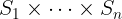

# Tuples

[[Back to all operators]](./standard-operators.md)

Tuples in TLA+ are special kinds of [functions](./functions.md) that satisfy one
of the following properties:

 - The domain is either empty, that is, `{}`, or
 - The domain is `1..n` for some `n > 0`.

That is right. You can construct the empty tuple `<<>>` in TLA+ as well as a
single-element tuple, e.g., `<<1>>`. You can also construct pairs, triples, an
so on, e.g., `<<1, TRUE>>`, `<<"Hello", "world", 2020>>`. If you think that
empty tuples do not make sense: In TLA+, there is no difference between tuples
and [sequences](./sequences.md).  Again, it is duck typing: Any function with
the domain `1..n` can be also treated as a tuple (or a sequence!), and vice
versa, tuples and sequences are also functions. So you can use all function
operators on tuples.

Importantly, the domain of a nonempty tuple is `1..n` for some `n > 0`. So tuples never
have a 0th element. For instance, `<<1, 2>>[1]` gives us 1, whereas `<<1,
2>>[2]` gives us 2.

**Construction.** TLA+ provides you with a convenient syntax for constructing
tuples. For instance, the following example shows how to construct a tuple
that has two fields: Field 1 is assigned value `2`, and field 2 is
assigned value `TRUE`.

```tla
  <<2, TRUE>>
```

There is a tuple set constructor, which is well-known as [Cartesian product]:

```tla
  { "Alice", "Bob" } \X (1900..2000)
```

The expression in the above example constructs a set of tuples `<<n, y>>`: the
first field `n` is set to either "Alice" or "Bob", and the second field `y` is set
to an integer from 1900 to 2000.

**Application.** Simply use function application, e.g., `t[2]`.

**Immutability**. As tuples are special kinds of [functions](./functions.md),
tuples are immutable.

**Types.** In contrast to pure TLA+ and TLC, the Apalache model checker
distinguishes between general functions, tuples, and sequences. They all have
different types. Essentially, a function has the type `A -> B` that
restricts the arguments and results as follows: the arguments have the type
`A` and the results have the type `B`. A sequence has the type
`Seq(C)`, which restricts the sequence elements to have the same type `C`. In
contrast, tuples have more fine-grained types in Apalache: `<<T_1>>`, `<<T_1,
T_2>>`, `<<T_1, T_2, T_3>>` and so on. As a result, different tuple fields are
allowed to carry elements of different types, whereas functions and sequences
are not allowed to do that. See the [Apalache ADR002][] on types for details.

As tuples are also sequences in TLA+, this poses a challenge for the Apalache
type checker. For instance, it can immediately figure out that `<<1, "Foo">>`
is a tuple, as Apalache does not allow sequences to carry elements of different
types. However, there is no way to say, whether `<<1, 2, 3>>` should be treated
as a tuple or a sequence. Usually, this problem is resolved by annotating the
type of a variable or the type of a user operator. See [HOWTO write type
annotations][].

_Owing to the type information, tuples are translated into SMT much more efficiently
by Apalache than the general functions and sequences!_

----------------------------------------------------------------------------

## Operators

In the Python examples, we are using the package [frozendict], to produce an
immutable dictionary.

----------------------------------------------------------------------------


<a name="tuple"></a>
### Tuple/Sequence constructor

**Notation:** `<<e_1, ..., e_n>>`

**LaTeX notation:** 

**Arguments:** An arbitrary number of arguments.

**Apalache type:** This operator is overloaded. There are two potential types:

  1. A tuple constructor: `(a_1, ..., a_n) => <<a_1, ..., a_n>>`,
    for some types `a_1, ..., a_n`.
  1. A sequence constructor: `(a, ..., a) => Seq(a)`, for some type `a`.

That is why the Apalache type checker is sometimes asking you to add annotations,
in order to resolve this ambiguity.

**Effect:** The tuple constructor returns a function `t` that is constructed
as follows:

 - set `DOMAIN t` to `1..n`,
 - set `r[i]` to the value of `e_i` for `i \in 1..n`.

In Apalache, this constructor may be used to construct either a tuple, or a
sequence. To distinguish between them, you will sometimes need a [type
annotation].

**Determinism:** Deterministic.

**Errors:** No errors.

**Example in TLA+:**

```tla
  <<"Printer", 631>>
```

**Example in Python:** Python provides us with the syntax for constructing
tuples, which are indexed with 0!. If we want to stick to the
principle "tuples are functions", we have to use a dictionary.

```python
>>> ("Printer", 631)          # the pythonic way, introducing fields 0 and 1
('Printer', 631)
>>> { 1: "Printer", 2: 631 }  # the "tuples-are-functions" way
{1: 'Printer', 2: 631}

```

----------------------------------------------------------------------------

<a name="times"></a>
### Cartesian product

**Notation:** `S_1 \X ... \X S_n` (or `S_1 \times ... \times S_n`)

**LaTeX notation:** 

**Arguments:** At least two arguments. All of them should be sets.

**Apalache type:** `(Set(a_1), ..., Set(a_n)) => Set(<<a_1, ..., a_n>>)`,
    for some types `a_1, ..., a_n`.

**Effect:** The Cartesian product `S_1 \X ... \X S_n`
is syntax sugar for the set comprehension:

```tla
{ << e_1, ..., e_n >> : e_1 \in S_1, ..., e_n \in S_n }
```

**Determinism:** Deterministic.

**Errors:** The arguments `S_1, ..., S_n` must be sets. If they are not sets,
the result is undefined in pure TLA+. TLC raises a model checking error. Apalache
flags a static type error.

TLC raises a model checking error, whenever one of the sets `S_1, ..., S_n` is
infinite. Apalache can handle infinite sets in some cases, e.g., when one tuple
is picked with `\E t \in S_1 \X S_2`.

**Example in TLA+:**

```tla
  { "A", "B", "C" } \X (1..65535)
    \* A set of tuples. Each tuple has two fields:
    \*   - field 1 has the value from the set { "A", "B", "C" }, and
    \*   - field 2 has the value from the set 1..65535.
```

**Example in Python:** TLA+ functions are immutable, so we are using [frozendict]:

```python
  # the pythonic way: a set of python tuples (indexed with 0, 1, ...)
  frozenset({ (n, p)
                for n in { "A", "B", "C" } for p in range(1, 65535 + 1) })
  # the TLA+ way
  frozenset({ frozendict({ 1: n, 2: p })
                for n in { "A", "B", "C" } for p in range(1, 65535 + 1) })
```

----------------------------------------------------------------------------

<a name="app"></a>
### Function application

As tuples are functions, you can access tuple elements by [function
application](./functions.md#funApp), e.g., `tup[2]`. However, in the case of a
tuple, the type of the function application will be: `(<<a_1, ..., a_i, ...,
a_n>>, Int) => a_i`, for some types `a_1, ..., a_n`.


[Control Flow and Non-determinism]: ./control-and-nondeterminism.md
[Specifying Systems]: http://lamport.azurewebsites.net/tla/book.html?back-link=learning.html
[frozendict]: https://pypi.org/project/frozendict/
[Paxos]: https://github.com/tlaplus/Examples/blob/master/specifications/Paxos/Paxos.tla
[Apalache ADR002]: ../adr/002adr-types.md
[Cartesian product]: https://en.wikipedia.org/wiki/Cartesian_product
[HOWTO write type annotations]: ../../HOWTOs/howto-write-type-annotations.md
