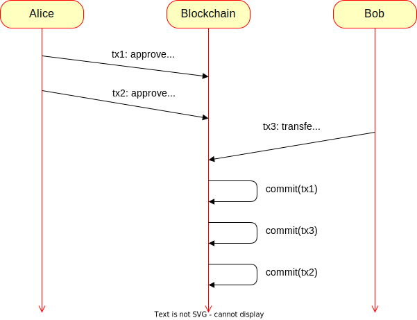
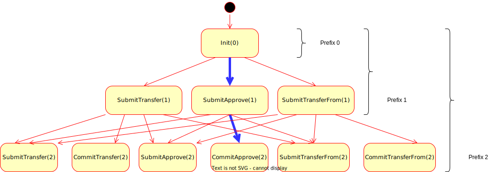
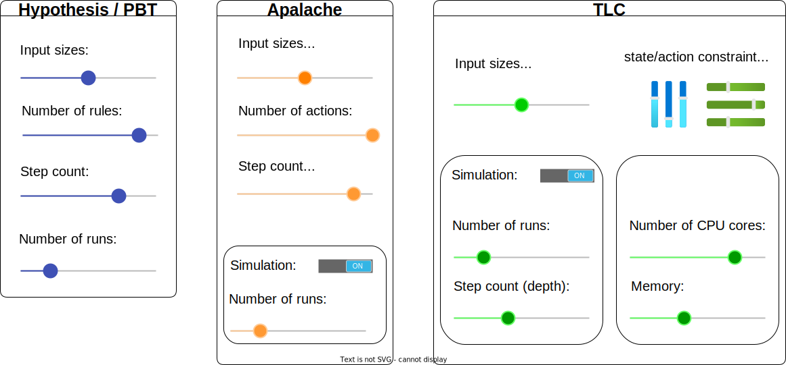

# Tutorial on Checking ERC20 with Property-Based Testing and TLA+

**Difficulty: Red trail – Medium**

**Author: Igor Konnov, Jure Kukovec**

**Last update: June 7, 2022**

In this tutorial, we discuss the API of the [ERC20][] tokens, which are
commonly used in the [Ethereum][] blockchain. This API is particularly
interesting, as it has a well-known [EIP20 attack vector][], discussed
in [EIP20][].

We demonstrate how one can model this API in Python and test it via stateful
testing, which is popularized by property-based testing tools such as
[Hypothesis][].

Further, we show how to specify this API in TLA+ and analyze it it with two
model checkers: Apalache and TLC. Our hope is that this tutorial will help clarify the relative strengths and weaknesses of these approaches.

## 1. Prerequisites

In this tutorial, we do not explain the basics of TLA+. If you need such a
tutorial, check [Entry-level Tutorial on the Model Checker][].

We assume that you have Apalache installed. If not, check the manual page on
[Apalache installation][]. The minimal required version is 0.25.5.

Additionally, in this tutorial we assume that you understand property-based
testing. In particular, we are using the [Hypothesis][] framework for [Python][].

## 2. Running example: ERC20

### 2.1. Three methods of ERC20

As a running example, we consider a smart contract that implements an [ERC20][]
token. To understand this example, you do not have to know much about
blockchains and smart contracts. In a nutshell, ERC20 implements a protocol for a set of users, each holding some amount of tokens. For simplicity, we can assume
that we have only three users: Alice, Bob, and Eve. For example, at some point
the balances of their tokens may be as follows:

```
  balanceOf["Alice"] == 3
  balanceOf["Bob"] == 5
  balanceOf["Eve"] == 10
```
where `balanceOf` is a function mapping each address identifier (or, for simplicity, user) to their balance in the current state.
If our users do nothing but hold their tokens, it is a little bit boring. In ERC20,
they can transfer tokens via a "transfer" transaction:

```
  transfer(sender, toAddr, value)
```

By invoking a "transfer" transaction, the user `sender` transfers `value`
tokens to the user whose address is stored in `toAddr`, provided that the
sender has a balance of at least `value` tokens. Technically, contracts
store the balances for addresses, not users, but we will be talking about
users, to keep things simple.

Consider the following two transactions executed in some order, starting from the state described above, where `Alice`, `Bob` and `Eve` hold `3`, `5` and `10` tokens respectively:

```
  transfer("Alice", "Bob", 2)   # transaction A
  transfer("Bob", "Eve", 6)     # transaction B
```

In the above example, Alice attempts to send two tokens to Bob in transaction A, and Bob attempts to send six tokens to Eve in transaction B. Interestingly, if transaction B is processed before transaction A,
then transaction B will fail, since Bob has only 5 tokens in his account.

Things get more complicated, when we consider the possibility that some of the users are actually programs (called smart contracts). Say, Eve is a smart contract.
It often happens that human users want smart contracts transferring tokens on their behalf. However, it would be a bit dangerous, if a contract
could transfer an arbitrary number of tokens from the user's account. To this
end, ERC20 specifies "approve" transactions:

```
  approve(sender, spender, value)
```

By invoking an "approve" transaction, the user `sender` authorizes the user
`spender` to transfer at most `value` tokens on the behalf of `sender`.
However, the spender cannot do such a transfer via a "transfer" transaction.
Hence, ERC20 introduces a third type of transactions:

```
  transferFrom(sender, fromAddr, toAddr, value)
```

By invoking a "transferFrom" transaction, the sender attempts to transfer `value` tokens from the address `fromAddr` to the address `toAddr`. This can only be done if `sender` was authorized to transfer at least `value` tokens from the address `fromAddr`.

### 2.2. A known issue

Although this API looks reasonable, the [EIP20 attack vector][] shows that it
may behave in a way that some users do not expect. We refer the reader to the
above document for the context. Here we give a sequence of problematic
transactions:



Here is what is shown in the above example. Alice approves Bob to transfer
up to 3 tokens. This transaction is added to the transaction pool, but it is
not committed immediately, as it takes the consensus engine some time to select
this transaction and commit it. Meanwhile, Alice decides to lower her approval
to Bob, and she issues another "approve" transaction that limits the amount of
tokens to 2. 
It is important to note here, that "approve" sets the approved amount _to_ the specified value, it does not increase it _by_ the specified value. Therefore, `approve("Alice", "Bob", 3)` followed immediately by `approve("Alice", "Bob", 2)` (in the commit history) would result in a state where the amount of tokens approved to be used by Bob is 2, not 5.

However, Bob is actively monitoring the transaction pool, and he
observes that there are two approvals issued by Alice. So he quickly issues a
"transferFrom" transaction. If he gets lucky (e.g., he gives more gas to his
transaction than Alice did), then his transfer happens after the first approval
but before the second approval. If that happened, he issues another
"transferFrom" transaction and collects five tokens in total, though Alice's
intention was to authorize Bob to transfer up to three tokens (and later, even
two tokens instead of three).

### <a href="erc20-events"></a> 2.3. How to discover it?

Can we use some automation to discover such an execution? By looking at the
above example, we can see that the core of this question is whether we can find
the following sequence of events, for some values `n >= k > m >= l > 0`, and distinct addresses/users `u1, u2, u3`, such that `balanceOf[u1] >= k + l`:

  1. submit `tx1: approve(u1, u2, n)`
  1. submit `tx2: approve(u1, u2, m)` 
  1. submit `tx3: transferFrom(u2, u1, u3, k)`
  1. commit `tx1`
  1. commit `tx3`

Once we have reached a state via the sequence of events 1-5, we can see that
it should be possible to extend it with the following events:

  6. commit `tx2`
  1. submit `tx4: transferFrom(u2, u1, u3, l)`
  1. commit `tx4`

Hence, in the rest of this tutorial, we focus on finding a valid sequence of
events 1-5.

## 3. Stateful testing with Hypothesis

Since we are talking about an API, it is quite tempting to implement this API in a programming language, for example, in [Python][]. We give only the interesting parts of the code. A complete example is available in [test_erc20.py][].

### 3.1. Restricting the scope

Before writing the code of the transactions, we should think about the scope of
our tests:

 - *Do we have to run the tests against the actual blockchain?*
   It does not seem that we need that to reason about the API.

 - *Do we have to use the actual Ethereum data structures?*
   Again, this is not needed for reasoning about the API.

 - *Do we have to express amounts as 256-bit integers (as in Ethereum)
    and search over the full range of Ethereum addresses (20 bytes)?*

The last question is of particular interest, as the search spaces in modern
programming languages are simply astronomic. We assume the small scope
hypothesis, which is usually phrased as follows, e.g., at [Alloy Wikipedia
page][]:

> [...] a high proportion of bugs can be found by testing a program for all test
> inputs within some small scope.

By following this hypothesis, we limit the space of addresses and amounts to
small sets (in Python):

```tla
{{#include ../../../test/tla/tutorials/randomized/test_erc20.py:23:28}}
```

### 3.2. Introducing transactions

Following ERC20, we introduce three classes of transactions in Python:

```tla
{{#include ../../../test/tla/tutorials/randomized/test_erc20.py:31:58}}
```

### 3.3. Introducing and initializing the state machine

We model the API of ERC20 as a [rule-based state machine]. As explained in the
documentation of the Hypothesis library, we introduce a class that
models executions of this state machine:

```tla
{{#include ../../../test/tla/tutorials/randomized/test_erc20.py:60:67}}

    # more code follows...
```

The testing framework uses this state machine to randomly generate executions
that are described by a set of rules, which we present below. Before we dive
into the rules, we have to initialize the state machine for every run:

```tla
{{#include ../../../test/tla/tutorials/randomized/test_erc20.py:72:87}}
```

The code of the method `init` is self-explanatory. The most interesting part
belongs to the annotation inside `@initialize(...)`. Basically, it tells the
testing framework that the input parameter `amounts` should be a randomly
generated list, whose elements are randomly drawn from the list `AMOUNTS`. We
limit the size of the list `amounts` with the parameters `min_size` and
`max_size`. To better understand generators, check the page on the [Hypothesis
generators][].

The Hypothesis framework requires us to define where to generate transactions and where to read them from. This is done via bundles. To this end, we introduce a bundle:

```tla
{{#include ../../../test/tla/tutorials/randomized/test_erc20.py:68:70}}
```

### 3.4. Generating transactions

To generate "transfer" transactions, we introduce the rule `submit_transfer`:

```tla
{{#include ../../../test/tla/tutorials/randomized/test_erc20.py:88:96}}
```

Similar to `init`, the method parameters `_sender`, `_toAddr`, and `_value` are
randomly drawn from the lists `ADDR` and `AMOUNTS`. A generated transaction of
type `TransferTx` is added to the bundle `pendingTxs`, which is specified via
the parameter `target` in the annotation `@rule`.

We will see later that bundles cannot be used for specifying invariants.
Hence, we add the transaction to a shadow copy, which we call
`self.pendingTxsShadow`. Additionally, we reset `self.lastTx`. This will also be needed for writing an invariant.

We define the rules `submit_transferFrom` and `submit_approve` similar to
`submit_transfer`:

```tla
{{#include ../../../test/tla/tutorials/randomized/test_erc20.py:97:115}}
```

### 3.5. Committing transactions

To commit a generated transaction, we introduce the rule `commit_transfer`:

```tla
{{#include ../../../test/tla/tutorials/randomized/test_erc20.py:116:127}}
```

The majority of the above code should be clear. However, there are two new
constructs in `commit_transfer`. First, we consume a transaction via
`tx=consumes(pendingTxs)`, which deletes a transaction from the bundle
`pendingTxs` and instantiates the input parameter `tx` with the chosen value. On top of that, we add the statement `assume(...)` inside the method. This statement tells the testing framework to reject the cases that violate the assumption. 

Similar to `commit_transfer`, we define the rules `commit_transfer_from` and
`commit_approve`:

```tla
{{#include ../../../test/tla/tutorials/randomized/test_erc20.py:129:152}}
```

### 3.6. Introducing state invariants

Since we are writing a test to check some properties, we have to specify these
properties. The simplest property that we want to test is whether the account
balances may be negative:

```tla
{{#include ../../../test/tla/tutorials/randomized/test_erc20.py:153:157}}
```

There is not much to explain about the above code. It is important to
understand that this invariant is checked after the execution of `init` and after the execution of every rule in a test run.

We also write an invariant that we actually want to test:

```
{{#include ../../../test/tla/tutorials/randomized/test_erc20.py:159:174}}
```

The above invariant specifies a state that is produced by the sequence of
events 1-5, as discussed in [Section 2.3](#erc20-events).

### 3.7. Generating the test runs

Finally, we add the test class to the test suite:

```
{{#include ../../../test/tla/tutorials/randomized/test_erc20.py:193:202}}
```

The most important parameters are as follows:

 - `max_examples` limits the number of test executions to generate,
 - `stateful_step_count` limits the length of test executions, and
 - `deadline` limits the run-time of every execution,
   which we set to `None`, as the run-times may vary.

We run the test with the Python testing framework as follows:   

```sh
pytest --hypothesis-show-statistics
```

We have run the test five times. Each run took 1.5 hours on average. Here is
the typical output by `pytest`:

```  
  - Typical runtimes: 0-3 ms, ~6% in data generation
   - 100000 passing examples, 0 failing examples, 365850 examples
   - Events:
    * 8.82%, approve
    * 1.73%, transfer
    * 0.00% transferFrom
```

Finally, on the sixth run, the test detected an invariant violation after
34 minutes:

```
  Falsifying example:
  state = Erc20Simulator()
  state.init(amounts=[0, 0, 2])
  state.all_transfers_approved()
  state.non_negative_balances()
  v1 = state.submit_approve(_sender='Eve', _spender='Alice', _value=1)
  state.all_transfers_approved()
  state.non_negative_balances()
  v2 = state.submit_approve(_sender='Eve', _spender='Alice', _value=2)
  state.all_transfers_approved()
  state.non_negative_balances()
  state.commit_approve(tx=v2)
  state.all_transfers_approved()
  state.non_negative_balances()
  v3 = state.submit_transfer_from(_fromAddr='Eve',
                                  _sender='Alice', _toAddr='Bob', _value=2)
  state.all_transfers_approved()
  state.non_negative_balances()
  state.commit_transfer_from(tx=v3)
  state.all_transfers_approved()
  state.teardown()
```

We have managed to find the expected invariant violation, though it took
us about 8 hours and about 2 million runs to enumerate. 


### <a name="pbt-explosion"></a> 3.8. Why does it take so long?

If you are interested in the detailed analysis of probabilities, see the [math section](#math) below.

In summary, there are `600'397'329'064'743` (6e14) possible executions, discounting premature termination due to e.g. insufficient coverage or commits preceding submissions.
The odds of hitting an invariant violation are 6e-7 for our concrete selection of 3 addresses and 20 values.

We were reasonably lucky that Hypothesis reported an invariant violation after exploring about 2 million runs (after exploring runs for 8 hours). Perhaps, Hypothesis is using clever heuristics to enumerate runs.

### 3.9. Lessons learned

Some lessons learned:

 - It took us several iterations to debug the Python code,
   since these errors are only reported at runtime. To strengthen the model,
   we would have to write unit tests for the simulator.

 - Since the tests take a lot of time, there is always a doubt about whether
   the invariants are written correctly. It is not easy to guide the framework
   into an interesting state.

 - Random exploration produces plenty of invalid executions (about 80% in
   our case), which are rejected by the framework.

 - We had to carefully tune the maximum number of steps in a single run.
   The number of steps is inversely proportional to the probability of finding an invariant violation.

 - Given our complexity estimates and the run-times, it looks like our
   example is on the edge of what is feasible with Hypothesis.

## 4. Symbolic simulation with Apalache

Let us repeat the same exercise with TLA+ and Apalache. Although TLA+ is not a
programming language, we will see that the TLA+ specification is structurally
quite similar to the test that we have developed for Hypothesis. In contrast to
8 hours of running PBT, we find the same execution with Apalache in 12 seconds.
So it is probably worth looking at.

We assume that you already know the basics of TLA+. The complete specification
and its model checking instance can be found in [ERC20.tla][] and
[MC_ERC20.tla][].

### 4.1. The shape of the state machine

Similar to our Python code in [test_erc20.py][], we declare the set of all
addresses. In contrast to the code, we declare `ADDR` and `AMOUNTS` as
constants, which are instantiated later:

```
{{#include ../../../test/tla/tutorials/randomized/ERC20.tla:17:25}}
```

Since we specify a state machine, we declare the state variables of our state
machine that we obviously need for [ERC20][]:

```
{{#include ../../../test/tla/tutorials/randomized/ERC20.tla:27:38}}
```

Similar to the Python code, we declare additional state variables:

```
{{#include ../../../test/tla/tutorials/randomized/ERC20.tla:39:56}}
```

### 4.2. Initializing the state machine

As usual, we describe the initial states via the predicate `Init`:

```
{{#include ../../../test/tla/tutorials/randomized/ERC20.tla:57:68}}
```

### 4.3. Submitting transactions

To submit a "transfer" transaction, we introduce the action `SubmitTransfer`:

```
{{#include ../../../test/tla/tutorials/randomized/ERC20.tla:79:87}}
```

The above code is simple. We construct a transaction as a record and add
it to the set of the pending transactions.

Similar to that, we define the actions `SubmitApprove` and `SubmitTransferFrom`:

```
{{#include ../../../test/tla/tutorials/randomized/ERC20.tla:167:177}}
```

```
{{#include ../../../test/tla/tutorials/randomized/ERC20.tla:123:134}}
```

### 4.4. Committing transactions

To commit a transfer transaction, we introduce the action `CommitTransfer`:

```
{{#include ../../../test/tla/tutorials/randomized/ERC20.tla:91:108}}
```

The interesting aspect here is that we mark a transaction as failed, if it
violates the validation rules. Although it is not important in this
tutorial, it is a good pattern, which lets us produce transactions that can
be used to test the actual implementation with an end-to-end testing framework
such as [Atomkraft][].

Similar to `CommitTransfer`, we define the action `CommitApprove` and
`CommitTransferFrom`:


```
{{#include ../../../test/tla/tutorials/randomized/ERC20.tla:138:161}}
```

```
{{#include ../../../test/tla/tutorials/randomized/ERC20.tla:180:193}}
```

### 4.5. Introducing the transition predicate

As usual, we introduce the predicate called `Next` that captures the choice of
actions:

```
{{#include ../../../test/tla/tutorials/randomized/ERC20.tla:194:209}}
```

We non-deterministically pick one of the six actions at each step. The action
parameters are non-deterministically chosen via the operator "exists", e.g.,
`\E value \in AMOUNTS`. Note that we simply draw integer values from the set
`AMOUNTS`, as there is no need to restrict this set. Although TLA+ as a
language does not have randomization, some tools may interpret non-determinism
as random choice.

### 4.6. Introducing state invariants

Similar to `all_transfers_approved` in [test_erc20.py][], we define the
following state invariant:

```
{{#include ../../../test/tla/tutorials/randomized/ERC20.tla:241:255}}
```

### 4.7. Introducing an instance for model checking

Our TLA+ specification is parameterized in the sets `ADDR` and `AMOUNTS`. In
order to run Apalache, we have to initialize these constants. The complete code
can be found in [MC_ERC20.tla][]. The most important definitions are as
follows:

```tla
\* Use the set of three addresses.
\* We are using uninterpreted values, similar to TLC's model values.
\* See: https://apalache.informal.systems/docs/HOWTOs/uninterpretedTypes.html
ADDR == { "Alice_OF_ADDR", "Bob_OF_ADDR", "Eve_OF_ADDR" }

\* Apalache can draw constants from the set of all integers
AMOUNTS == Int
```

### 4.8. Checking the invariant via symbolic simulation

Having defined the specification and its instance, we run Apalache to perform
symbolic simulation:

```sh
$ apalache-mc simulate --length=10 --max-run=10000 \
  --inv=NoTransferFromWhileApproveInFlight MC_ERC20.tla
...  
State 10: state invariant 0 violated.
...
It took me 0 days  0 hours  0 min 12 sec
```

As we can see, Apalache came back after enumerating 33 runs in 12 seconds. You
can check [counterexample10.tla][] to make sure that it indeed violates the
invariant.

It did not report the shortest execution though. This is because we have run
Apalache in the simulation mode. In this mode, it randomly chooses one of the
enabled actions at every step and adds it to a set of constraints that encode
an execution. Whether there is an execution that satisfies the constraints is
determined by the SMT solver [Z3][].

Consider the following figure:



Here is what is happening in the figure:

 1. Apalache applies the predicate `Init`. This gives us an execution prefix of
 length 0, which contains only `Init`. Apalache checks the invariant for 
 Prefix 0 as a set of constraints with Z3.

 1. Apalache finds that three actions are enabled in the end of Prefix 0:
 `SubmitTransfer`, `SubmitApprove`, and `SubmitTransferFrom`. The model checker
 randomly picks the action `SubmitApprove`. This gives us an execution prefix
 of length 1, which is obtained by applying `Init` and then `SubmitApprove`.
 This gives us Prefix1. Apalache checks the invariant in the end of Prefix 1 as
 a set of constraints with Z3.

 1. Apalache finds that there are four enabled actions in the end of Prefix 1:
 `SubmitTransfer`, `SubmitApprove`, `SubmitTransferFrom`, and `CommitApprove`.
 It randomly picks the action `CommitApprove`, forming Prefix 2.  Apalache
 checks the invariant in the end of Prefix 2 as a set of constraints with Z3.

 1. We repeat this process for Prefix 2, ..., Prefix 9, and Prefix 10.
 Finally, at Prefix 10, Apalache finds an execution that is described by Prefix
 10 and violates the invariant `NoTransferFromWhileApproveInFlight`.

Actually, the process described in 1-4 was repeated multiple times. In our
case it was 33 times, but it may differ from run to run. We call this process
*symbolic simulation*, since it combines two techniques in one:

 - When we fix the sequence of actions, we perform symbolic execution. The
   symbolic execution is encoded in the prefixes: Prefix 0, ..., Prefix 10.

 - We pick the sequences of actions at random, similar to random simulation.

### <a name="how-many"></a> 4.9. How many symbolic runs do we have?

Recall that, in theory, we had to explore millions of random executions with
Hypothesis, see [Section 3.8](#pbt-explosion). This is due to the fact that we had to randomly pick a rule to execute as well as its inputs. With symbolic
simulation, we only have to randomly pick an action, and the rest is done by
the solver. Hence, we can roughly estimate the number of different symbolic
runs:

 1. When we limit executions to length 5, we have at most`6^5 = 7776`
   combinations.

 1. When we limit executions to length 10, we have at most`6^10 = 60,466,176`
   combinations.

How many of these executions would let us discover the invariant violation?
When we limit the length to 5, there is only one symbolic execution that
describes exactly the [sequence of events](#erc20-events) in Section 2.3 (and 12 that find the same category of behavior, with a permutation of independent actions). So we have a 12 in 7776 chance to find the bug. If we run the simulation 7776 times, we should find it with high probability. In this example, it takes about 1 second to analyze one symbolic run. Hence, we should find this bug in about 1 hour on average. Given that we usually find it in a matter of seconds, our estimate on the number of symbolic runs is probably too pessimistic.

When we limit the length to 10, it seems that we have an unmanageable number of
runs. However, recall that we have to find a run that contains the [sequence of
events](#erc20-events) as a subsequence! 

Interestingly, when we set the execution length to 50, Apalache typically finds
an invariant violation in the first symbolic run after 20-40 steps in 5-7
seconds. This is probably explained by uniform randomization of actions and
that multiple short runs are packed in a single long run.

## 5. Bounded model checking with Apalache

Do we have to enumerate runs at all? This is a good question. Apalache supports
another mode, called "model checking", that analyzes all symbolic runs of given
length at once, without enumerating them one by one.

### 5.1. Finding a invariant violation

In symbolic simulation, we randomly picked a sequence of actions and delegated
the discovery of "right" inputs to the solver. In contrast, in the checking
mode, we additionally delegate the choice of actions to the solver as well:

```sh
$ apalache-mc check --length=10 \
  --inv=NoTransferFromWhileApproveInFlight MC_ERC20.tla
...  
State 5: state invariant 0 violated.
...
It took me 0 days  0 hours  0 min 7 sec
```

This time the model checker has found the shortest execution that violates
the invariant. You can examine it in [counterexample5.tla][].

### 5.2. When there is no invariant violation

So far, the difference between `simulate` and `check` was not obvious.  Their
performance seems to be comparable. We can see a dramatic difference when we
test an invariant that actually holds true. Consider the following invariant:

```
{{#include ../../../test/tla/tutorials/randomized/ERC20.tla:256:260}}
```

Let us check all executions that make up to 10 steps with Apalache:

```sh
apalache-mc check --length=10 --inv=NoNegativeBalances MC_ERC20.tla
...
Checker reports no error up to computation length 10
It took me 0 days  0 hours  9 min 32 sec
```

Now we know that, no matter what, the *invariant holds true on all states that
are reachable in at most 10 steps*.

As we discussed in [Section 4.9](#how-many), we have to check about 7776
symbolic runs, to get a high probability of exploring all executions:

```sh
apalache-mc simulate --length=10 --max-run=7776 \
  --inv=NoNegativeBalances MC_ERC20.tla
...
Checker reports no error up to computation length 10
It took me 0 days  0 hours 26 min 50 sec
```

Although it took Apalache longer, it has enumerated 7776 symbolic runs.
However, the important difference between `simulate` and `check` is that
`simulate` does not give us an ultimate guarantee about all executions, even
though we limit the scope to all executions of length up to 10, whereas `check`
does.

### 5.3. What about longer executions?

As we have seen, Apalache can give us a guarantee about all executions of
predefined length. What if we want to analyze all possible executions? This is
harder. We refer the reader to the section on [Checking an inductive
invariant][]. We will write another tutorial on this topic.

## 6. State enumeration with TLC

So far we have been using Hypothesis and Apalache. Since we have a TLA+
specification, we can easily run the standard explicit model checker TLC too.

### 6.1. Setting up TLC

Before you can run TLC in the command-line, you have to download it:

```sh
wget https://github.com/tlaplus/tlaplus/releases/download/v1.8.0/tla2tools.jar
```

We have to define two auxiliary files (created with [TLA+ Toolbox][]):

 - a configuration file [MC_tlc_check.cfg][]:
   - we define `ADDR` as a constant set of three model
     values: `{A_Alice, A_Bob, A_Eve}`
   - we define `AMOUNTS` to be a fixed range of `0..19`, similar
     to our Hypothesis tests.
   - further, we inform TLC that it can use symmetry reduction over `ADDR`.

 - a model file [MC_tlc_check.tla][]

### 6.2. Simulation with TLC

TLC has a built-in simulation mode, which randomly produces traces. In our
case, it can be run as follows (set `$APALACHE_HOME` to the directory
where Apalache is installed):

```sh
java -DTLA-Library=$APALACHE_HOME/src/tla -jar tla2tools.jar \
  -config MC_tlc_check.cfg -simulate num=1000000000 -depth 10 MC_tlc_check.tla
...
Error: Invariant NoTransferFromWhileApproveInFlight is violated.
...
The number of states generated: 1843943938
Progress: 1843943943 states checked, 183661963 traces generated (trace length: mean=10, var(x)=0, sd=0)
Finished in 01h 09min at (2022-05-27 17:52:48)
```

As we can see, TLC has found an invariant violation after 1 hour, though it is
a matter of luck, since the simulation is done at random. Interestingly, TLC enumerated traces faster than Hypothesis did in our experiments with
[test_erc20.py][], see [Section 3.7](#37-generating-the-test-runs).

Surprisingly, *when we set the search depth to 30 or even 50, TLC finds an
invariant violation in less than a minute*. On the other hand, when we set the
depth to 5, it enumerates the maximum number of runs without hitting a bad
state. Understanding this relation between the number of steps and the time to
find a bug needs further research.

### 6.3. State enumeration with TLC

Similar to model checking with Apalache, we can run TLC to check the invariant
via state enumeration:

```sh
java -DTLA-Library=$HOME/devl/apalache/src/tla -jar tla2tools.jar \
  -config MC_tlc_check.cfg -fpmem .75 MC_tlc_check.tla
```

Note that we let TLC use 75% of the available memory and ran it on 4 CPU
cores (make sure you have them or change this setting!). Our experiments server
ran out of disk space (100 GB) after 1 hour and 20 minutes. TLC has produced
738 million distinct states, most of them left in the search queue. By that
time, it has reached a diameter of 3, whereas it would need a diameter of 5
to find an invariant violation.

## 7. Conclusions

We summarize our findings in the following table.

*We only ran one experiment for each row in the table. To get a better
understanding of the average running times, we would have to perform each
experiment multiple times. Hence, take these figures as one observation, not as
a hard fact.*

| Input      | Tool | Method | Performance bottleneck | Complete? | Time (one experiment!) | Runs/states |
| ---------- | ---- | ------ | ---------------------- |:---------:|:----:|:----:|
| Python PBT | [Hypothesis][] | Property-based testing, stateful testing | combinatorial explosion of executions | no | 8 hours | 2M runs |
| TLA+       | [Apalache][] | Symbolic simulation | combinatorial explosion of symbolic executions & SMT | no | 5 sec for `length=50`; 12 sec for `length=10`| 33 |
| TLA+       | [Apalache][] | Bounded model checking | combinatorial explosion in SMT | yes: for fixed length and fixed parameters | 7 sec | 1 |
| TLA+       | [TLC][] | Explicit enumeration + simulation | combinatorial explosion of executions | no | < 1 min for `depth=50`; 1 hour 9 min for `depth=10`| 183M |
| TLA+       | [TLC][] | Explicit model checking | combinatorial explosion of states | yes: for fixed parameters | >1.5h, out of disk space, reached diameter 3 | 738M states |

Since we have conducted the experiments on a single benchmark, we are not
trying to draw general conclusions from this table. However, we propose some
intuition about why the tools behaved this way:

 - Stateful testing with PBT is randomly choosing rules and their inputs.
   Hence, in theory, this approach should be most susceptible to combinatorial explosion, of the ones in our experiments. Nevertheless, the tool has found an invariant violation.
   We do not know, whether it was sheer luck or clever heuristics of
   Hypothesis. Interestingly, increasing the number of steps did not help us in
   finding an error faster, in contrast to TLC and Apalache.

 - Symbolic simulation with Apalache was very quick at finding an error. This
   is due to the fact the number of *symbolic runs* grows much slower than
   the number of *concrete runs* in this example. Interestingly, when we
   increase the number of steps, Apalache finds an invariant violation even
   faster.

 - Bounded model checking with Apalache was the fastest one. This should not
   come as a surprise, as we are using the SMT solver [Z3][]. The SAT/SMT
   community have been tackling NP-complete problems and combinatorial
   explosion for decades. Hence, SMT is better tuned to the search problem than
   an ad-hoc random exploration. As we have seen, this mode slows down when
   there is no error.

 - For a depth of 50, both TLC and Apalache found an invariant violation very
   quickly (less than a minute and 5 seconds, respectively). For a depth of 10, the TLC simulation was dramatically slower than the Apalache simulation. 
   The number of traces generated in 1 hour was significantly larger than the
   number of traces produced with Hypothesis in that same time. It would be interesting to see why this happened. We conjecture that the simulation technique of TLC selects from a uniform distribution over successor states, not over the enabled actions.

 - Explicit state enumeration with TLC was extremely slow. This is not very
   surprising, as TLC has to deal with relatively large state spaces here.
   Since TLC implements breadth-first search, it has to enumerate a massive
   number of states, before it increases the depth.

It is also important to understand all kinds of controls that we have over the
search process in the tools. For instance, removing the "transfer" transaction
would significantly reduce the size of the search problem, and it is safe to do
so for checking `NoTransferFromWhileApproveInFlight`. The following figure
summarizes all kinds of controls that we have found in Hypothesis, Apalache,
and TLC.



The most important controls are the size of the inputs and the number of
actions/rules. These parameters are under the control of the specification writer, and they affect the search problem the most. 
The second most important controls are those that control the scope of the search such as the number of steps and the number of runs to try. 
Both Apalache and TLC allow the user to switch between simulation and classical model checking. 
Simulation is typically much faster and scales much better with a larger number of steps in a run. 
However, simulation is inherently incomplete and requires some pen & paper reasoning to understand the achieved coverage, as we have done in this tutorial. 
Classical model checking modes come with proven guarantees of completeness, though these guarantees vary depending on the implemented technique. 
Finally, TLC has extensive controls on the number of cores and memory usage. Although these controls do not change the size of the problem, they may help one get tool feedback faster.

If you are curious, we have tried to push the parameters of Hypothesis and TLC
to the absolute minimum, e.g., by setting `AMOUNTS` to `0..2` and restricting
the number of steps to 5. This has not led to a significant improvement in
performance.

In conclusion, we believe that all these methods and tools have their place in
a developer's toolkit. However, as with all advanced tools, we have to
understand, where they fit in the development process and what can affect their
performance and completeness. For instance, the Apalache team uses the
property-based testing framework [Scalacheck][] to find hardcore bugs in the
model checker itself. We call this tool [Nitpick][].

*Disclaimer*: Although we are expert users of Apalache and TLC, we are
beginners in Hypothesis. If you know how to improve our experience with
Hypothesis, please let us know. A pedantic reader will notice that we have
chosen Python, which is probably not the most performant programming language.
We chose Python for its simplicity and relative popularity. One can probably
achieve much better performance with Rust or Golang. If you would like to
contribute a property-based test similar to [test_erc20.py][] and contribute
the experimental results to this tutorial, please let us know. We will be happy
to include them in this tutorial.

## <a name="math"></a> The math
In this section, we show the full details of the probability analysis for finding the invariant-violating trace from [Section 3.8](#pbt-explosion).

Let us parameterize the problem in the following way: assume we are performing a random simulation, where one of 6 actions is chosen at each of the 5 steps, uniformly at random. Each action parameter \\(value\\) is instantiated with one of \\(N_{val}\\) values, uniformly at random, and each action parameter \\(sender, spender, fromAddr, toAddr\\) is instantiated with one of \\(N_{addr}\\) values, uniformly at random.
For simplicity, assume values are sampled from \\(V = \\{1,\dots, N_{val}\\}\\) and addresses from \\(A = \\{a_1, \dots,a_{N_{addr}} \\}\\).
In the concrete simulation, the values were \\((N_{val},N_{addr}) = (20,3)\\).
We also assume the following:
  - The initial balances, which are also randomly determined, are sufficient to cover all simulated runs, to avoid having to reason about insufficient coverage case, since our goal is to find an example of over-spending.
  - the framework doesn't exit prematurely if an action is not viable, but chooses to treat it as a no-op instead (like the blockchain would)

In particular, this gives us \\(N_{addr}^2 \cdot N_{val}\\) \\(\text{submit\_transfer}\\) actions, \\(N_{addr}^2 \cdot N_{val}\\) \\(\text{submit\_approve}\\) actions, and \\(N_{addr}^3 \cdot N_{val}\\) \\(\text{submit\_transferFrom}\\) actions, plus three unique commit actions. In total, there are \\((N_{val} + 2)(N_{val}^2  \cdot N_{addr}) + 3\\) actions at every step, so 
\\(((N_{val} + 2)(N_{val}^2 \cdot N_{addr}) + 3)^5\\) possible runs. 
For our concrete parameters, this is approximately \\(6\cdot 10^{14}\\) runs.

We distinguish _actions_, which are one of \\(\text{submit\_approve}\\), \\(\text{submit\_transfer}\\), \\(\text{submit\_transferFrom}\\), \\(\text{commit\_approve}\\), \\(\text{commit\_transfer}\\), \\(\text{commit\_transferFrom}\\), from _action instances_, which are a combination of an action and concrete values for all of its action parameters (e.g. \\(\text{submit\_approve}(u_1,u_2,v)\\), for some \\(u_1,u_2,v\\))
 
Note that the model suggests that the action is selected before parameters (if any) are instantiated. 
In other words, the framework does _not_ uniformly select from action instances. 
This means that committing an approval is selected with a probability of \\(\frac{1}{6}\\) at each step, whereas \\(\text{approve}(u_1,u_2,v)\\) is selected with a probability of \\(\frac{1}{6  \cdot N_{addr}^2  \cdot N_{val}}\\), for any concrete choice of \\(u_1, u_2, v\\) (and a probability of \\(\frac{1}{6}\\) for _some_ choice of \\(u_1,u_2,v\\)).

Under these constraints, what is then the probability of executing a trace, which leads to an invariant violation?

Let us define the following events:
  - \\(\omega\\): a sequence of action instances is chosen, such that the invariant is violated
  - \\(\alpha\\): a sequence of actions is chosen, such that the invariant is violated for some selection of instance parameters

Observe that \\(\alpha \cap \omega = \omega\\).

We break the problem into two parts: Finding an action order, and finding parameters, assuming the order is fixed.
Concretely, we are going to find \\(P(\alpha)\\) and \\(P(\omega \mid \alpha)\\). Then, by the conditional probability rule,
\\[
P(\omega) =  P(\alpha \cap \omega) = P(\omega \mid \alpha) \cdot P(\alpha)
\\]

### Action orders that may lead to an invariant violation

In this section, we determine \\(P(\alpha)\\).

To find an invariant violation, we need the following five actions
  - \\(H, L\\) (both \\(\text{submit\_approve}\\), but distinguished based on which of them is referenced by the commit action, i.e. whether the value is high or low)
  - \\(T\\) (\\(\text{submit_transferFrom\}\\)) 
  - \\(C_A\\) (\\(\text{commit\_approve}\\) referencing \\(H\\))
  - \\(C_T\\) (\\(\text{commit\_transferFrom}\\))

under the following constraints:
  - \\(H\\) precedes \\(C\\) in the order
  - \\(C_T\\) is last in the sequence of 5 actions

There are 12 valid sequences that satisfy the constraints:
\\[
HLTC_AC_T,
HTLC_AC_T,
THLC_AC_T,
LHTC_AC_T
\\]
\\[
LTHC_AC_T,
TLHC_AC_T,
HLC_ATC_T,
HTC_ALC_T
\\]
\\[
THC_ALC_T,
LHC_ATC_T,
HC_ALTC_T,
HC_ATLC_T
\\]

This means that \\(P(\alpha)\\), the probability of finding the 5 transaction sorts in the order needed to violate the invariant is \\(\frac{12}{6^5}\\).

### Parameter instantiations that may lead to an invariant violation

In this section, we determine \\(P(\omega \mid \alpha )\\).

Assume now that we have selected an action order, which may lead to an invariant violation. We need to instantiate the parameters to \\(H,L,T\\):
  - \\(H: \text{submit\_approve}(sender_H, spender_H, v_H)\\)
  - \\(L: \text{submit\_approve}(sender_L, spender_L, v_L)\\)
  - \\(T: \text{submit\_transferFrom}(sender_T, from, to, v_T)\\)

subject to the following constraints:
  - \\(c_1: sender_H \ne spender_H\\)
  - \\(c_2: sender_L \ne spender_L\\)
  - \\(c_3: sender_T, from, to\\) pairwise distinct
  - \\(c_4: sender_H = sender_L = from\\)
  - \\(c_5: spender_H = spender_L = sender_T\\)
  - \\(c_6: v_H \ge v_T > v_L > 1\\)

Since values and addresses are selected independently, uniformly at random, the probability of picking both addresses satisfying the address constraints, \\(P(c_1, \dots, c_5)\\), and values satisfying the value constraint, \\(P(c_6)\\), are independent, so \\(P(\omega \mid \alpha) = P(c_1,\dots,c_5) \cdot P(c_6)\\).

Let us first consider \\(P(c_1, \dots, c_5)\\). There are 7 address values to pick, each selected from among \\(N_{addr}\\) addresses, so a total of \\(N_{addr}^7\\)possibilities. How many of those satisfy \\(c_1,\dots,c_5\\)?

Assume we pick one of \\(N_{addr}\\) values for \\(sender_H\\). 
This determines \\(sender_L\\) and \\(from\\) by \\(c_4\\). 
By \\(c_1\\), we have \\(N_{addr}-1\\) choices for \\(spender_H\\). 
Choosing one determines \\(spender_L\\) (satisfying \\(c_2\\) automatically), and \\(sender_T\\) by \\(c_5\\). 
What is left is selecting \\(to\\), which has \\(N_{addr}-2\\) candidates, by \\(c_3\\), for a total of \\(N_{addr}(N_{addr} - 1)( N_{addr} -2)\\) combinations, which satisfy all constraints.

In summary, the probability of randomly selecting addresses satisfying \\(c_1,\dots,c_5\\) is 
\\[
P(c_1,\dots, c_5) = \frac{N_{addr}(N_{addr} - 1)(N_{addr} - 2)}{N_{addr}^7} = \frac{(N_{addr} - 1)(N_{addr} - 2)}{N_{addr}^6}
\\]

To determine \\(P(c_6)\\), we observe that there are \\(N_{val}^3\\) total possible selections of triples \\((v_L,v_T,v_H)\\). 
The number of triples that satisfies \\(c_6\\) is
\\[
\sum_{a=1}^{N_{val}} \sum_{b=1}^{N_{val}} \sum_{c=1}^{N_{val}} \textbf{1}_{c \ge b > a > 1}
\\]

Where \\(\textbf{1}_{c \ge b > a > 1}\\) is the [indicator function](https://en.wikipedia.org/wiki/Indicator_function) of the event \\(c \ge b > a > 1\\), that is, equal to \\(1\\) iff \\(c \ge b > a > 1\\) and 0 otherwise.
We can therefore simplify the above sum to 

\\[
\sum_{a=2}^{N_{val}} \sum_{b=a+1}^{N_{val}} \sum_{c=b}^{N_{val}} 1
\\]

which has a closed-form solution \\(\frac{N_{val}(N_{val}^2 - 3N_{val} + 2)}{6}\\), giving us the following probability of choosing values satisfying \\(c_6\\):

\\[
P(c_6) = \frac{N_{val}(N_{val}^2 - 3N_{val} + 2)}{6N_{val}^3} = \frac{N_{val}^2 - 3N_{val} + 2}{6N_{val}^2}
\\]

Combining these results gives us:

\\[
P(\omega \mid \alpha) = P(c_1,\dots,c_5)\cdot P(c_6) = \frac{(N_{addr} - 1)(N_{addr} - 2)(N_{val}^2 - 3N_{val} + 2)}{6N_{val}^2N_{addr}^6}
\\]

### Probability of finding an invariant violation
 
Recall the conditional probability rule
\\[
P(\omega) =  P(\alpha \cap \omega) = P(\omega \mid \alpha) \cdot P(\alpha)
\\]

We can instantiate it with the computed probabilities, to determine:

\\[
P(\omega) = \frac{12(N_{addr} - 1)(N_{addr} - 2)(N_{val}^2 - 3N_{val} + 2)}{6^6N_{val}^2N_{addr}^6} = \frac{(N_{addr} - 1)(N_{addr} - 2)(N_{val}^2 - 3N_{val} + 2)}{3888 N_{val}^2N_{addr}^6}
\\]

which equals \\(\frac{19}{31492800}\\) (approximately \\(6 \cdot 10^{-7}\\)) for \\((N_{val},N_{addr}) = (20,3)\\).

Interestingly, the probability is asymptotically constant w.r.t. \\(N_{val}\\), but it is asymptotically inversely proportional to \\(N_{addr}^4\\).

We can see that for the following increases in address space size, the probability of finding an invariant by random exploration drops drastically:
Let us fix \\(N_{val} = 20\\) and increase \\(N_{addr}\\):
  - \\(N_{addr} = 10\\): \\(P(\omega) \doteq 1.5 \cdot 10^{-8}\\)
  - \\(N_{addr} = 50\\): \\(P(\omega) \doteq 3.3 \cdot 10^{-11}\\)
  - \\(N_{addr} = 100\\): \\(P(\omega) \doteq 2.1 \cdot 10^{-12}\\)
  - \\(N_{addr} = 1000\\): \\(P(\omega) \doteq 2.2 \cdot 10^{-16}\\)

For reference, the space of 20byte address admits \\(2^{160}\\) unique values.

[Apalache]: https://github.com/informalsystems/apalache/
[TLC]: https://github.com/tlaplus/tlaplus
[ERC20]: https://ethereum.org/en/developers/docs/standards/tokens/erc-20/
[EIP20]: https://eips.ethereum.org/EIPS/eip-20
[EIP20 attack vector]: https://docs.google.com/document/d/1YLPtQxZu1UAvO9cZ1O2RPXBbT0mooh4DYKjA_jp-RLM/edit#
[Ethereum]: https://ethereum.org/en/
[Hypothesis]: https://hypothesis.readthedocs.io/
[Python]: https://www.python.org/
[Apalache installation]: ../apalache/installation/index.md
[Entry-level Tutorial on the Model Checker]: ./entry-tutorial.md
[test_erc20.py]: https://github.com/informalsystems/tla-apalache-workshop/blob/main/examples/erc20-approve-attack/test_erc20.py
[Alloy Wikipedia page]: https://en.wikipedia.org/wiki/Alloy_(specification_language)
[rule-based state machine]: https://hypothesis.readthedocs.io/en/latest/stateful.html#rule-based-state-machines
[Hypothesis generators]: https://hypothesis.readthedocs.io/en/latest/data.html
[count_combinations.py]: https://github.com/informalsystems/tla-apalache-workshop/blob/main/examples/erc20-approve-attack/count_combinations.py
[ERC20.tla]: https://github.com/informalsystems/tla-apalache-workshop/blob/main/examples/erc20-approve-attack/ERC20.tla
[MC_ERC20.tla]: https://github.com/informalsystems/tla-apalache-workshop/blob/main/examples/erc20-approve-attack/MC_ERC20.tla
[Atomkraft]: https://github.com/informalsystems/atomkraft
[counterexample5.tla]: https://github.com/informalsystems/tla-apalache-workshop/blob/main/examples/erc20-approve-attack/counterexample5.tla
[counterexample10.tla]: https://github.com/informalsystems/tla-apalache-workshop/blob/main/examples/erc20-approve-attack/counterexample10.tla
[Z3]: https://github.com/Z3Prover/z3
[Checking an inductive invariant]: ./running.html#checking-an-inductive-invariant
[MC_tlc_check.tla]: https://github.com/informalsystems/tla-apalache-workshop/blob/main/examples/erc20-approve-attack/MC_tlc_check.tla
[MC_tlc_check.cfg]: https://github.com/informalsystems/tla-apalache-workshop/blob/main/examples/erc20-approve-attack/MC_tlc_check.cfg
[Scalacheck]: https://scalacheck.org/
[Nitpick]: https://github.com/informalsystems/apalache/issues/1588
[TLA+ Toolbox]: https://lamport.azurewebsites.net/tla/toolbox.html
