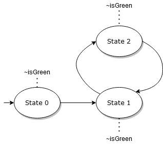

# Temporal properties and counterexamples

**Difficulty: Red trail – Medium**

**Author:** Philip Offtermatt, 2022

In this tutorial, we will show how Apalache can be used to decide temporal
properties that are more general than invariants.
This tutorial will be most useful to you if you have a basic understanding of
linear temporal logic, e.g. the semantics of `<>` and `[]` operators.
See a writeup of temporal operators [here](https://learntla.com/temporal-logic/operators/).

Further, we assume you are familiar with TLA+, but expert knowledge is not necessary.

As a running example, the tutorial uses a simple example specification, modelling a
devious nondeterministic traffic light.

## Specifying temporal properties

The traffic light has two main components: A lamp which can be either red or green,
and a button which can be pushed to request the traffic light to become green.
Consequently, there are two variables:
the current state of the light (either green or red),
and whether the button has been pushed that requests the traffic light to switch from red to green.

The full specification of the traffic light is here:
[TrafficLight.tla](TrafficLight.tla).  
But don't worry - we will dissect the spec in the following.

In the TLA specification, we declare two variables:

```
{{#include TrafficLight.tla:vars}}
```

Initially, the light is red and green has not yet been requested:

```
{{#include TrafficLight.tla:init}}
```

We have three possible actions: 
1. The traffic light can switch from red to green, 
2. The traffic light can switch from green to red, or
3. The button can be pushed, thus requesting that the traffic light becomes green.

```
{{#include TrafficLight.tla:actions}}
```

In the interest of simplicity, we'll assume that
the button cannot be pushed when green is already requested, and
that similarly it's not possible to push the button when the light is
already green.

Now, we are ready to specify the properties that we are interested in.
For example, when green is requested, at some point afterwards the light should actually turn green.
We can write the property like this:

```
{{#include TrafficLight.tla:prop}}
```
Intuitively, the property says: 
"Check that at all points in time ([]),
if right now, `RequestGreen` is true, 
then at some future point in time, `IsGreen` is true."

Let's run Apalache to check this property:

```
apalache-mc check --temporal=RequestWillBeFulfilled TrafficLight.tla
```
```
...
The outcome is: NoError       
Checker reports no error up to computation length 10
It took me 0 days  0 hours  0 min  2 sec
Total time: 2.276 sec
EXITCODE: OK
```

This is because our traffic watch is actually 
deterministic: 
If it is red and green has not been requested,
the only enabled action is `RequestGreen`.
If it is red and green has been requested,
only `SwitchToGreen` is enabled.
And finally, if the light is green,
only `SwitchToRed` is enabled.

However, we want to make our traffic light more devious.
We will allow the model to stutter, that is,
just let time pass and take no action.

We can write a new next predicate that explicitly allows
stuttering like this:

```
{{#include TrafficLight.tla:stutternext}}
```

Recall that `[Next]_vars` is shorthand for `Next \/ UNCHANGED vars`. Now, let us try to verify the property once again,
using the modified next predicate:

```
apalache-mc check --next=StutteringNext \
    --temporal=RequestWillBeFulfilled TrafficLight.tla
```
```
Step 2: picking a transition out of 3 transition(s)
State 3: Checking 1 state invariants
State 3: Checking 1 state invariants
State 3: Checking 1 state invariants
State 3: Checking 1 state invariants
Check an example state in: /home/user/apalache/docs/src/tutorials/_apalache-out/TrafficLight.tla/2022-05-30T18-04-13_3349613574715319837/counterexample1.tla, /home/user/apalache/docs/src/tutorials/_apalache-out/TrafficLight.tla/2022-05-30T18-04-13_3349613574715319837/MC1.out, /home/user/apalache/docs/src/tutorials/_apalache-out/TrafficLight.tla/2022-05-30T18-04-13_3349613574715319837/counterexample1.json, /home/user/apalache/docs/src/tutorials/_apalache-out/TrafficLight.tla/2022-05-30T18-04-13_3349613574715319837/counterexample1.itf.json E@18:04:16.346
State 3: state invariant 0 violated.
Found 1 error(s)
The outcome is: Error
Checker has found an error
It took me 0 days  0 hours  0 min  2 sec
Total time: 2.542 sec
```

This time, we get a counterexample.
Let's take a look at `/home/user/apalache/docs/src/tutorials/_apalache-out/TrafficLight.tla/2022-05-30T18-04-13_3349613574715319837/counterexample1.tla`.

Let's first focus on the initial state.

```
(* Initial state *)
(* State0 ==
  RequestWillBeFulfilled_init = FALSE
    /\ __loop_InLoop = FALSE
    /\ __loop_☐(requestedGreen ⇒ ♢isGreen) = FALSE
    /\ __loop_requestedGreen ⇒ ♢isGreen = TRUE
    /\ __loop_♢isGreen = FALSE
    /\ __loop_isGreen = FALSE
    /\ __loop_requestedGreen = FALSE
    /\ ☐(requestedGreen ⇒ ♢isGreen) = FALSE
    /\ ☐(requestedGreen ⇒ ♢isGreen)_unroll = TRUE
    /\ requestedGreen ⇒ ♢isGreen = TRUE
    /\ ♢isGreen = FALSE
    /\ ♢isGreen_unroll = FALSE
    /\ isGreen = FALSE
    /\ requestedGreen = FALSE *)
State0 ==
  RequestWillBeFulfilled_init = FALSE
    /\ __loop_InLoop = FALSE
    /\ __loop___temporal_t_1 = FALSE
    /\ __loop___temporal_t_2 = TRUE
    /\ __loop___temporal_t_3 = FALSE
    /\ __loop_isGreen = FALSE
    /\ __loop_requestedGreen = FALSE
    /\ __temporal_t_1 = FALSE
    /\ __temporal_t_1_unroll = TRUE
    /\ __temporal_t_2 = TRUE
    /\ __temporal_t_3 = FALSE
    /\ __temporal_t_3_unroll = FALSE
    /\ isGreen = FALSE
    /\ requestedGreen = FALSE
```

Two things are notable:
1. The initial state formula appears twice, once as a comment and once in TLA+.
2. There are way more variables than the two variables we specified.

The comment and the TLA+ specification express the same state, but in the comment, some variable names from the encoding have been replaced
with more human-readable names.
For example, there is a variable called `☐(requestedGreen ⇒ ♢isGreen)` in the comment,
which is called `__temporal_t_1` in TLA+.
In the following, let's focus on the content of the comment, since it's easier to understand what's going on.

There are many additional variables in the counterexample because to check temporal formulas, Apalache uses an
encoding that transforms temporal properties to invariants.
If you are interested in the technical details, the encoding is described in sections 3.2 and 4 of [Biere et al.][].
However, to understand the counterexample, you don't need to go into the technical details of the encoding.
We'll go explain the counterexample in the following.

We will talk about traces in the following.
You can find more information about (symbolic) traces [here](/tutorials/symbmc.html?highlight=trace#symbolic-traces).
For the purpose of this tutorial, however, it will be enough to think of a trace as a sequence of states
that were encountered by Apalache, and that demonstrate a violation of the property that is checked.

## Counterexamples encode lassos

First, it's important to know that for finite-state systems, counterexamples to temporal properties are traces ending in a loop,
which we'll call lassos in the following. If you want to learn more about why this is the case,
have a look at the book on [model checking](https://mitpress.mit.edu/books/model-checking-second-edition).

A loop is a partial trace that starts and ends with the same state. 
A lasso is made up of two parts: A prefix, followed by a loop.
It describes a possible infinite execution: first it goes through the prefix, and then repeats the loop forever.

For example, what is a trace that is a counterexample to the property `♢isGreen`?
It's an execution that loops without ever finding a state that satisfies `isGreen`.
For example, a counterexample trace might visually look like this:



In contrast, as long as the model checking engine has not found a lasso, there may still exist some future state satisfying `isGreen`.

## Utilizing auxiliary variables to find lassos

The encoding for temporal properties involves lots of auxiliary variables.
While some can be very helpful to understand counterexamples,
many are mostly noise.

Let's first understand how Apalache can identify lassos using auxiliary variables.
The auxiliary variable `__loop_InLoop` is true in exactly the states belonging to the loop.
Additionally, at the first state of the loop, i.e., when `__loop_InLoop` switches from false to true,
we store the valuation of each variable in a shadow copy whose name is prefixed by `__loop_`.
Before the first state of the loop, the `__loop_` carry arbitrary values.
In our example, it looks like this:
```
(* State0 ==
    ...
    /\ __loop_InLoop = FALSE
    ...
    /\ __loop_isGreen = FALSE
    /\ __loop_requestedGreen = FALSE
    ...
    /\ isGreen = FALSE
    /\ requestedGreen = FALSE *)

(* State1 ==
    ...
    /\ __loop_InLoop = FALSE
    ...
    /\ __loop_isGreen = FALSE
    /\ __loop_requestedGreen = FALSE
    ...
    /\ isGreen = FALSE
    /\ requestedGreen = TRUE *)

(* State2 ==
    ...
    /\ __loop_InLoop = FALSE
    ...
    /\ __loop_isGreen = FALSE
    /\ __loop_requestedGreen = FALSE
    ...
    /\ isGreen = FALSE
    /\ requestedGreen = TRUE *)

(* State3 ==
    ...
    /\ __loop_InLoop = TRUE
    ...
    /\ __loop_isGreen = FALSE
    /\ __loop_requestedGreen = TRUE
    ...
    /\ isGreen = FALSE
    /\ requestedGreen = TRUE *)
```
So, initially, `isGreen` and `requestedGreen` are both false.
Further, `__loop_InLoop` is false, and the copies of `isGreen` and `requestedGreen`, which are called
`__loop_isGreen` and `__loop_requestedGreen`, are equal to the values of `isGreen` and `requestedGreen`.

From state 0 to state 1, `requestedGreen` changes from false to true.
From state 1 to state 2, the system stutters, and the valuation of model variables remains unchanged.
Finally, in state 3 `__loop_InLoop` is set to true, which means that
the loop starts in state 2, and the trace from state 3 onward is inside the loop.
However, since state 3 is the last state, this means simply that the trace loops in state 2.
Since the loop starts, the copies of the system variables are also set to the values of the variables in state 2,
so ` __loop_isGreen = FALSE` and `__loop_requestedGreen = TRUE`.


The lasso in this case can be visualized like this:

](img/counterexample.png)

It is also clear why this trace violates the property:
`requestedGreen` holds in state 1, but `isGreen` never holds,
so in state 1 the property `requestedGreen => <>isGreen` is violated.

## Auxiliary variables encode evaluations of subformulas along the trace

Next, let us discuss the other auxiliary variables that are introduced by Apalache to check the temporal property.
These extra variables correspond to parts of the temporal property we want to check.
These are the following variables with their valuations in the initial state:

```
(* State0 ==
  RequestWillBeFulfilled_init = FALSE
    ...
    /\ ☐(requestedGreen ⇒ ♢isGreen) = FALSE
    /\ ☐(requestedGreen ⇒ ♢isGreen)_unroll = TRUE
    /\ requestedGreen ⇒ ♢isGreen = TRUE
    /\ ♢isGreen = FALSE
    /\ ♢isGreen_unroll = FALSE
    ...
```
There are three groups of variables: 
* Variables that look like formulas, e.g. `☐(requestedGreen ⇒ ♢isGreen)`
* Variables that look like formulas and end with `_unroll`,
e.g. `☐(requestedGreen ⇒ ♢isGreen)_unroll`
* The variable `RequestWillBeFulfilled_init`.

Let's focus on the non-`_unroll` variables that look like formulas
first.

Recall that the temporal property we want to check is `[](requestedGreen => <>isGreen)`.
That's also the name of one of the variables: The value of the variable 
`☐(requestedGreen ⇒ ♢isGreen)` tells us whether starting in the current state, the
formula `[](requestedGreen => <>isGreen)` holds. Since we are looking at a counterexample to this formula, it is not
surprising that the formula does not hold in the initial state of the counterexample.

Similarly, the variable `requestedGreen ⇒ ♢isGreen` tells us whether
the property `requestedGreen ⇒ ♢isGreen` holds at the current state.
It might be surprising to see that the property holds
but recall that in state 0, `requestedGreen = FALSE`, so the implication is satisfied.
Finally, we have the variable `♢isGreen`, which is false, telling
us that along the execution, `isGreen` will never be true.

You might already have noticed the pattern of which formulas appear as variables.
Take our property `[](requestedGreen => <>isGreen)`.
The syntax tree of this formula looks like this:

](img/syntaxtree.png)

For each node of the syntax tree where the formula contains a temporal operator,
there is an auxiliary variable. 
For example, there would be auxiliary variables for the formulas `[]isGreen`
and `(<>isGreen) /\ ([]requestedGreen)`, but not for the formula `isGreen /\ requestedGreen`.

As mentioned before, the value of 
an auxiliary variable in a state tells us whether from that state, the corresponding subformula is true.
In this particular example, the formulas that correspond to variables in the encoding are filled with orange in the syntax tree.

What about the `_unroll` variables? There is one `_unroll` variable for each immediate application of a temporal operator in the formula.
For example, `☐(requestedGreen ⇒ ♢isGreen)_unroll` is the unroll-variable for the
leading box operator. 

To illustrate why these are necessary, consider the formula
`[]isGreen`. To decide whether this formula holds in the last state of the loop, the algorithm needs to know whether
`isGreen` holds in all states of the loop. So it needs to store this information when it traverses the loop.
That's why there is an extra variable, which stores whether `isGreen` holds on all states of the loop, and Apalache can access this information when it explores the last state of the loop.
Similarly, the unroll-variable `♢isGreen_unroll` holds true
if there is a state on the loop such that `isGreen` is true.

Let us take a look at the valuations of `☐(requestedGreen ⇒ ♢isGreen)_unroll` along our counterexample to see this.

```
(* State0 ==
    ...
    /\ __loop_InLoop = FALSE
    ...
    /\ ☐(requestedGreen ⇒ ♢isGreen) = FALSE
    /\ ☐(requestedGreen ⇒ ♢isGreen)_unroll = TRUE
    ...

(* State1 ==
    ...
    /\ __loop_InLoop = FALSE
    ...
    /\ ☐(requestedGreen ⇒ ♢isGreen) = FALSE
    /\ ☐(requestedGreen ⇒ ♢isGreen)_unroll = TRUE
    ...

(* State2 ==
    ...
    /\ __loop_InLoop = FALSE
    ...
    /\ ☐(requestedGreen ⇒ ♢isGreen) = FALSE
    /\ ☐(requestedGreen ⇒ ♢isGreen)_unroll = TRUE
    ...

(* State3 ==
    ...
    /\ __loop_InLoop = TRUE
    ...
    /\ ☐(requestedGreen ⇒ ♢isGreen) = FALSE
    /\ ☐(requestedGreen ⇒ ♢isGreen)_unroll = FALSE
    ...
```

So in the last state, `☐(requestedGreen ⇒ ♢isGreen)_unroll`
is not true, since `☐(requestedGreen ⇒ ♢isGreen)`
does not hold in state 2, which is on the loop.

Similar to the `__loop_` copies for model variables,
we also introduce copies for all (temporal) subformulas, e.g., `__loop_☐(requestedGreen ⇒ ♢isGreen)` for `☐(requestedGreen ⇒ ♢isGreen)`.
These fulfill the same function as the `__loop_` copies for the
original variables of the model, i.e., retaining the state of variables from the first state of the loop, e.g.,

```
(* State0 ==
    ...
    /\ __loop_☐(requestedGreen ⇒ ♢isGreen) = FALSE
    /\ __loop_requestedGreen ⇒ ♢isGreen = TRUE
    /\ __loop_♢isGreen = FALSE
    /\ __loop_isGreen = FALSE
    /\ __loop_requestedGreen = FALSE
```

Finally, the variable `RequestWillBeFulfilled_init` is an artifact of the translation for temporal properties.
Intuitively, in any state, the variable will be true if the variable encoding the formula `RequestWillBeFulfilled`
is true in the first state.
A trace is a counterexample if `RequestWillBeFulfilled` is false in the first state, so `RequestWillBeFulfilled_init` is false,
and a loop satisfying requirements on the auxiliary variables is found.
## Specifying Fairness

The latest version of our traffic light is quite malicious:
It can delay the switch to green forever, even after the green light has been requested.
This doesn't seem particularly realistic.
Suppose we want to change this behaviour:
After green is requested, the light must eventually turn green, but there can be an arbitrary finite delay.

We can use *fairness* for this. 
In particular, we will use *weak fairness*.
Formally, weak fairness is defined as follows:
```
WF_vars(SwitchToGreen) <=> <>[](ENABLED <<SwitchToGreem>>_vars) => []<><<SwitchToGreen>>_vars
```
where `<<SwitchToGreen>>_vars <=> SwitchToGreen /\ ~(UNCHANGED vars)`.
The formal definition may look intimidating, but the meaning is intuitive:
"If `SwitchToGreen` is enabled forever from some point onwards, then we should also infinitely often use `SwitchToGreen`".
So if your traffic light is forever able to turn on the green light, then it must eventually do so.
This exactly disallows the case where the switch to green is delayed forever.

In addition to having fairness on `SwitchToGreen`, let's also add fairness for the switch to red to our model.
It would be quite unfair for other people in traffic if the light must switch to green if it is requested to do so,
but does not in turn eventually switch back to red.

Lastly, our model should be perfectly fine if the green light is never requested.
So having fairness on `RequestGreen` does not seem necessary.

Overall, let's adjust our temporal property as follows:

```
{{#include TrafficLight.tla:fairprop}}
```
This says that if a trace is fair, it should satisfy `RequestWillBeFulfilled`.

Let us check this property with Apalache:

```
apalache-mc check --next=StutteringNext \
    --temporal=RequestsFulfilledIfFair TrafficLight.tla
```

You should see output like this:

```
The outcome is: NoError
Checker reports no error up to computation length 10
It took me 0 days  0 hours  2 min  2 sec
Total time: 122.10 sec
EXITCODE: OK
```

You might notice a hefty slowdown, compared to the version without fairness. 
Unfortunately, the translation of enabledness and fairness internally can be expensive for large actions.
Often, it is possible to manually specify fairness conditions more succinctly.
For example, notice that all we want is that it shouldn't be the case that
from some point onward, 
either of `SwitchToGreen` or `SwitchToRed` is enabled forever.
If either was enabled forever, the corresponding action should be used,
which then disables it (until it may later again be enabled).
Instead of using fairness, we can write the property like this:

```
{{#include TrafficLight.tla:nicefair}}
```

Now, let us once again check the property with Apalache:

```
apalache-mc check --next=StutteringNext \
    --temporal=RequestManualFairness TrafficLight.tla
```

This time, you should get a result much faster:

```
The outcome is: NoError
Checker reports no error up to computation length 10
It took me 0 days  0 hours  0 min 36 sec
Total time: 36.116 sec
EXITCODE: OK
```

In this case, it took just over a quarter as long to check 
the property under the manual fairness requirement than under weak fairness.
In general, when using fairness, it's worth spending some effort to simplify
the fairness condition.

## Further reading

In this tutorial, we learned how to specify temporal properties
in Apalache, and how to read counterexamples for such properties.

If you want to dive deeper into the
encoding, it is formally explained in sections 3.2 and 4 of
[Biere et al.]. To understand why this encoding was chosen,
you can read the [ADR on temporal properties].
Finally, if you want to go into the nitty-gritty details and see
the encoding in action,
you can look at the intermediate TLA specifying the encoding.

Run

```
apalache-mc check --next=StutteringNext \
    --write-intermediate=yes --temporal=RequestWillBeFulfilled TrafficLight.tla
```

You will get intermediate output in a folder named like
`_apalache_out/TrafficLight/TIMESTAMP/intermediate/`.
There, take a look at `0X_OutTemporalPass.tla`.


[Biere et al.]: https://lmcs.episciences.org/2236
[ADR on temporal properties]: ../adr/017pdr-temporal.md
