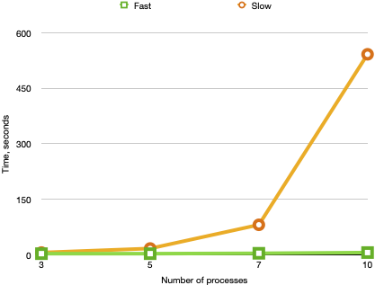

# Apalache trail tips: how to check your specs faster

**Difficulty: Red trail – Medium**

This tutorial collects tips and tricks that demonstrate the strong sides of
Apalache.

## Tip 1: Use TLA+ constructs instead of explicit iteration

<a name="fold-except"></a>

The [Apalache
antipatterns](../apalache/antipatterns.md#incremental-computation) mention that
one should not use explicit iteration (e.g., [`ApaFoldSet` and
`ApaFoldSeqLeft`](../apalache/principles/folds.md)), unless it is really needed. In
this tip, we present a concrete example that demonstrates how explicit
iteration slows down Apalache.

In our example, we model a system of processes from a set `Proc` that are
equipped with individual clocks. These clocks may be completely unsynchronized.
However, they get updated uniformly, that is, all clocks have the same speed.

Let's have a look at the first part of this specification:

```tla
{{#include ../../../test/tla/antipatterns/fold-except/FoldExcept.tla:1:23}}
```

As we can see, the constant `Proc` is a specification parameter. For instance,
it can be equal to `{ "p1", "p2", "p3" }`. The variable `clocks` assigns a
clock value to each process from `Proc`, whereas the variable `drift` collects
the clock difference for each pair of processes from `Proc`. This relation
is easy to see in the predicate `Init`:

```tla
{{#include ../../../test/tla/antipatterns/fold-except/FoldExcept.tla:24:27}}
```

Further, we write down a step of our system:

```tla
{{#include ../../../test/tla/antipatterns/fold-except/FoldExcept.tla:28:34}}
```

The transition predicate `NextFast` uniformly advances the clocks of all
processes by a non-negative number `delta`. Simultaneously, it updates the
clock differences in the function `drift`.

It is easy to see that `drift` actually does not change between the steps.  We
can formulate this observation as an [action
invariant](../apalache/principles/invariants.md#action-invariants):

```tla
{{#include ../../../test/tla/antipatterns/fold-except/FoldExcept.tla:54:58}}
```

Our version of `NextFast` is quite concise and it uses the good parts of
TLA+. However, new TLA+ users would probably write it differently. Below, you
can see the version that is more likely to be written by a specification
writer who has good experience in software engineering:

```tla
{{#include ../../../test/tla/antipatterns/fold-except/FoldExcept.tla:35:53}}
```

The version `NextSlow` is less concise than `NextFast`, but it is probably easier to
read for a software engineer. Indeed, we update the variable `clocks` via
a set fold, which implements an iteration over the set of processes. What makes
it easier to understand for a software engineer is a local update in the
operator `IncrementInLoop`. Likewise, the variable `drift` is iteratively
updated with the operator `SubtractInLoop`.

If `ApaFoldSet` looks unfamiliar to you, check the page on [folding sets and
sequences](../apalache/principles/folds.md).

Although `NextSlow` may look more familiar, it is significantly harder for
Apalache to check than `NextFast`. To see the difference, we measure
performance of Apalache for several sizes of `Proc`: 3, 5, 7, and 10. We do
this by running Apalache for the values of `N` equal to 3, 5, 7, 10.  To this
end we define several model files called `MC_FoldExcept${N}.tla` for
`N=3,5,7,10`. For instance, `MC_FoldExcept3.tla` looks as follows:

```tla
{{#include ../../../test/tla/antipatterns/fold-except/MC_FoldExcept3.tla:1:17}}
```

We run Apalache for different instances of `N`:

```sh
apalache-mc check --next=NextSlow --inv=DriftInv MC_FoldExcept${N}.tla
apalache-mc check --next=NextFast --inv=DriftInv MC_FoldExcept${N}.tla
```

The plot below shows the running times for the versions `NextSlow` and
`NextFast`:



The plot speaks for itself. The version `NextFast` is dramatically faster than
`NextSlow` for an increasing number of processes. Interestingly, `NextFast` is
also more concise. In principle, both `NextFast` and `NextSlow` describe the
same behavior. However, `NextFast` looks higher-level: It looks like it
computes `clocks` and `drifts` in parallel, whereas `NextSlow` computes
these functions in a loop (though the order of iteration is unknown). Actually,
whether these functions are computed sequentially or in parallel is irrelevant
for our specification, as both `NextFast` and `NextSlow` describe a *single
step* of our system! We can view `NextSlow` as an implementation of `NextFast`,
as `NextSlow` contains a bit more computation details.

From the performance angle, the above plot may seem counterintuitive to
software engineers. Indeed, we are simply updating an array-like data structure
in a loop. Normally, it should not be computationally expensive. However,
behind the scenes, Apalache is producing constraints about all function
elements for each iteration. Intuitively, you can think of it as being *fully
copied at every iteration*, instead of one element being updated. From this
perspective, the iteration in `NextSlow` should clearly be less efficient.

